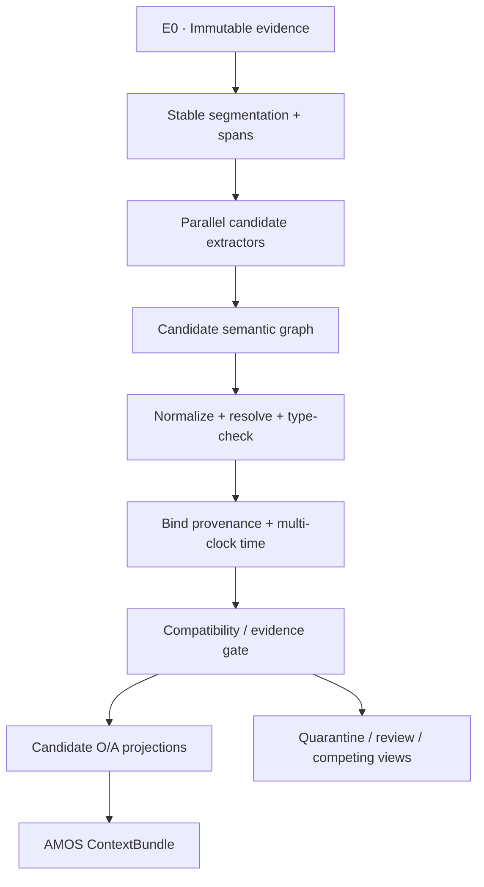

# AMOS Semantic Relation Layer v0.1: что действительно можно извлечь из Sepia

**Исследовательский отчёт для AIMETON Memory OS — AMOS**  
**Снимок репозитория:** `Nanako0129/sepia`, commit [`d8a0f948cc46a0ba0d610df7458c4e8943bfe51a`](https://github.com/Nanako0129/sepia/commit/d8a0f948cc46a0ba0d610df7458c4e8943bfe51a), 2026-09-05  
**Дата отчёта:** 2026-09-06T05:46:20Z  
**Объект решения:** не humanizer, а переносимые средства декомпозиции текста, типизации отношений, временной/причинной/дискурсивной интерпретации и их безопасного включения в `O`/`A`-проекции AMOS.

---

## Как читать доказательность

В отчёте используются пять меток. Они не являются взаимозаменяемыми.

| Метка | Значение | Что она разрешает утверждать |
|---|---|---|
| **M** — measured | Измеренный результат статьи или датасета в указанной выборке | «В этой выборке наблюдалось X» |
| **H-S** — Sepia heuristic | Авторская редакционная эвристика или интерпретация Sepia | «Sepia предлагает X»; не «X доказано» |
| **V** — vendor | Рекомендация или самоотчёт поставщика модели/детектора | Только версия- и продукт-специфичный сигнал |
| **C** — community | Практика сообщества, style guide, wiki/advice | Идея для теста, не эмпирическое основание |
| **I-AMOS** — inference | Вывод и проектное предложение настоящего исследования | Кандидат на реализацию и проверку, не факт о Sepia |

Ключевой инвариант: **высокая точность классификации происхождения текста не доказывает точность извлечения сущностей, событий или отдельных семантических связей**. Поэтому результаты StoryScope нельзя переносить в AMOS как готовую оценку semantic extraction.

---

# A. Executive conclusion

| Решение | Вывод |
|---|---|
| **Usefulness for AMOS** | **5/10 в целом**; около **2/10 как готовая технология**, около **7/10 как источник диагностических представлений и отрицательных требований** |
| **Fork** | **NO** |
| **Integrate directly** | **NO** |
| **Harvest ideas** | **YES** |
| **Primary target** | В первую очередь граница **E1 → E2**; затем кандидаты для **O** (entity/event/state/time) и **A** (evidence/discourse/recontextualization). `R` и `V` — только при явном тексте и отдельной проверке authority/scope |
| **Наиболее обоснованный вариант** | **E — комбинация классического NLP, структурированного LLM extraction и evidence gates**; первичные работы и датасеты существенно ценнее самой Sepia |

Sepia **не является semantic parser**. В репозитории нет исполняемого слоя извлечения сущностей и отношений, формальной онтологии, span-level provenance, нормализованной relation schema, temporal constraint solver, confidence calibration или семантического benchmark. Это набор инструкций для написания/редактирования: сам [`SKILL.md`](https://github.com/Nanako0129/sepia/blob/d8a0f948cc46a0ba0d610df7458c4e8943bfe51a/skills/sepia/SKILL.md#L9-L15) определяет цель как de-AI writing, а операции `write/review/refactor/recreate` — как редакторские режимы, не extraction API ([строки 37–48](https://github.com/Nanako0129/sepia/blob/d8a0f948cc46a0ba0d610df7458c4e8943bfe51a/skills/sepia/SKILL.md#L37-L48)).

Тем не менее Sepia содержит несколько хороших **зёрен-представлений**:

1. **Смотреть глубже предложений:** тема, причинная непрерывность, event ordering, disclosure order, QUD абзаца, actor-network shape.
2. **Разводить время события и порядок рассказа:** flashback/flash-forward, delayed/back-loaded disclosure и «позднее знание меняет чтение раннего фрагмента».
3. **Привязывать диагноз к цитате:** правило `no quote, no signal` — сильный прототип span provenance, хотя ещё не доказательство истинности связи.
4. **Не форсировать оценку:** `n/a`, отсутствие aggregate score и отказ превращать corpus percentage в вероятность отдельного текста.
5. **Разделять measurement и prescription:** после PR #7 репозиторий явно маркирует редакционные рецепты как Sepia inference, а не результат эксперимента.
6. **Доменно калибровать проверку:** postmortem, issue/PR, ticket и release note требуют разных информационных контрактов.
7. **Хранить последующее переосмысление как новую связь**, а не переписывать исходный фрагмент — это особенно хорошо совпадает с неизменяемым `E0` AMOS.

Но эти идеи следует заново реализовать на более зрелых основаниях:

- predicate–argument structure: **PropBank/SRL, FrameNet, AMR/UDS, OpenIE**;
- events и межсобытийные связи: **MAVEN/MAVEN-ERE**;
- время: **TimeML + Allen/OWL-Time + MATRES/TB-Dense**;
- причинность: **CaTeRS, Causal-TimeBank, CATENA, MAVEN-ERE**;
- discourse: **PDTB, RST-DT**;
- QUD: **QUD dependency parsing/QUDSELECT**, а QUDsim — лишь дополнительная диагностика;
- source-relative factuality и evidence: **FactBank, FEVER, SciFact, W3C PROV**;
- русский язык: **NEREL, FrameBank, Russian GUM/RST**, плюс собственная временная и QUD-калибровка.

**Рекомендуемое решение:** строить собственный `AMOS Semantic Extraction Layer`, где любая извлечённая связь сначала является `SemanticRelationCandidate`, несёт точный source span, источник/говорящего, extractor version, explicitness, отдельные confidence/authority/evidence поля и не попадает в `O`/`A` без compatibility gate. Sepia использовать как checklist и источник ablation-гипотез, но не как dependency и не как источник истины.

---

## Метод и охват аудита

Проверен полный приложенный снимок репозитория: 80 файлов, включая обязательные `SKILL.md`, narrative/discourse/rubric/professional/model-fingerprints, все domain/language/voice references, `research/`, eval workflow и тесты. История проверена по commit/PR/Issue, особенно [PR #7](https://github.com/Nanako0129/sepia/pull/7), [#24](https://github.com/Nanako0129/sepia/pull/24), [#168](https://github.com/Nanako0129/sepia/pull/168), [#229](https://github.com/Nanako0129/sepia/pull/229), [#231](https://github.com/Nanako0129/sepia/pull/231), [#232](https://github.com/Nanako0129/sepia/pull/232), [#234](https://github.com/Nanako0129/sepia/pull/234) и [Issue #227](https://github.com/Nanako0129/sepia/issues/227). У upstream StoryScope проверены статья, `taxonomy.json` и extraction/application prompts. Научные утверждения сопоставлены с primary papers, официальными датасетами и стандартами.

### Что обнаружено в реализации, а не в рекламном описании

- Исполняемый код Sepia ограничен проверкой согласованности версий; [unit tests](https://github.com/Nanako0129/sepia/blob/d8a0f948cc46a0ba0d610df7458c4e8943bfe51a/tests/test_check_versions.py#L1-L19) также проверяют версии. Semantic extraction runtime отсутствует.
- Единственный [behavioral workflow](https://github.com/Nanako0129/sepia/blob/d8a0f948cc46a0ba0d610df7458c4e8943bfe51a/.github/workflows/behavioral-eval.yml#L1-L11) запускает один [release-note rewrite case](https://github.com/Nanako0129/sepia/blob/d8a0f948cc46a0ba0d610df7458c4e8943bfe51a/evals/deaify-release-note/prompt.md#L1-L12); в PR #24 и ветка с Sepia, и baseline получили 1.00. Это не оценивает entities/relations/time/causality/QUD.
- 30-feature rubric — ручная эвристическая диагностика, не опубликованный XGBoost: это прямо сказано в [`rubric.md` L1–5](https://github.com/Nanako0129/sepia/blob/d8a0f948cc46a0ba0d610df7458c4e8943bfe51a/skills/sepia/references/rubric.md#L1-L5).
- Репозиторий уже содержит полезную внутреннюю самокоррекцию: [`research/sources.md` L140–142](https://github.com/Nanako0129/sepia/blob/d8a0f948cc46a0ba0d610df7458c4e8943bfe51a/research/sources.md#L140-L142) запрещает трактовать ассоциации/classifier results как проверку порядка проходов, рецептов или thresholds.
- Issue #227 показывает практическую ошибку интерфейса: открытый, человекочитаемый `Voice fit` был потреблён как типизированная запись. Для AMOS это прямой аргумент в пользу закрытых словарей, JSON Schema и versioned contracts до подключения downstream consumers.

---

# B. Full grain inventory

## B1. Полный инвентарь переносимых зёрен

Оценка usefulness: `5` — основа v0.1; `4` — сильный дополнительный сигнал; `3` — полезная гипотеза; `2` — только bounded experiment; `1` — не переносить.

| Grain | Sepia location | Primary source | Evidence level | AMOS usefulness | Target layer |
|---|---|---|---|---:|---|
| Явное разделение measured findings и editorial prescriptions | [`SKILL.md` L11](https://github.com/Nanako0129/sepia/blob/d8a0f948cc46a0ba0d610df7458c4e8943bfe51a/skills/sepia/SKILL.md#L11), [`sources.md` L140–142](https://github.com/Nanako0129/sepia/blob/d8a0f948cc46a0ba0d610df7458c4e8943bfe51a/research/sources.md#L140-L142) | Не внешний механизм; хороший research hygiene | H-S, поддержано историей PR #7 | **5** | E1/E2 governance |
| Untrusted-input boundary: текст и ссылки — данные, не инструкции/authority | [`SKILL.md` L13–15](https://github.com/Nanako0129/sepia/blob/d8a0f948cc46a0ba0d610df7458c4e8943bfe51a/skills/sepia/SKILL.md#L13-L15) | Общая security practice | H-S | **5** | ingestion/security |
| Сначала извлечь facts, claims, intent; затем проверить отсутствие invention | [`SKILL.md` L41–48](https://github.com/Nanako0129/sepia/blob/d8a0f948cc46a0ba0d610df7458c4e8943bfe51a/skills/sepia/SKILL.md#L41-L48) | Faithful summarization / claim extraction важнее, чем упомянутые редакторские studies | H-S → I-AMOS | **4** | E1→E2 |
| Никогда не выдумывать versions/numbers/timestamps/quotes; missing → TODO/question | [`SKILL.md` L64–70](https://github.com/Nanako0129/sepia/blob/d8a0f948cc46a0ba0d610df7458c4e8943bfe51a/skills/sepia/SKILL.md#L64-L70) | Evidence-grounded generation practice | H-S | **5** | all projections |
| Architecture sheet как многопроекционная декомпозиция | [`narrative-pass.md` L7–24](https://github.com/Nanako0129/sepia/blob/d8a0f948cc46a0ba0d610df7458c4e8943bfe51a/skills/sepia/references/narrative-pass.md#L7-L24) | StoryScope/NarraBench | M для corpus dimensions; H-S для target bands | **3** | candidate O/A |
| Theme: explicit / implied / withheld | [`narrative-pass.md` L11–14, 26–40](https://github.com/Nanako0129/sepia/blob/d8a0f948cc46a0ba0d610df7458c4e8943bfe51a/skills/sepia/references/narrative-pass.md#L11-L40) | StoryScope | M как story-level feature; H-S как writing rule | **4** при жёстком epistemic typing | E2/A |
| Causal-chain continuity как отдельный диагностический признак | [`narrative-pass.md` L42–55](https://github.com/Nanako0129/sepia/blob/d8a0f948cc46a0ba0d610df7458c4e8943bfe51a/skills/sepia/references/narrative-pass.md#L42-L55), [`rubric.md` L46–55](https://github.com/Nanako0129/sepia/blob/d8a0f948cc46a0ba0d610df7458c4e8943bfe51a/skills/sepia/references/rubric.md#L46-L55) | StoryScope; для настоящей extraction — CaTeRS/MAVEN-ERE | M на уровне story score; не edge accuracy | **3** | event graph |
| Отличие origin/agency разрешения от самого outcome | [`narrative-pass.md` L57–67](https://github.com/Nanako0129/sepia/blob/d8a0f948cc46a0ba0d610df7458c4e8943bfe51a/skills/sepia/references/narrative-pass.md#L57-L67) | StoryScope | M/H-S | **3** | event/actor roles |
| Time structure: linear / anachrony / braided | [`narrative-pass.md` L17–18, 69–81](https://github.com/Nanako0129/sepia/blob/d8a0f948cc46a0ba0d610df7458c4e8943bfe51a/skills/sepia/references/narrative-pass.md#L17-L18) | StoryScope; TimeML/Allen/MATRES сильнее | M как aggregate feature | **5** как design prompt, не schema | O temporal |
| Revelation pacing отдельно от chronology | [`narrative-pass.md` L69–81](https://github.com/Nanako0129/sepia/blob/d8a0f948cc46a0ba0d610df7458c4e8943bfe51a/skills/sepia/references/narrative-pass.md#L69-L81) | StoryScope/NarraBench | M story-level | **5** | A/discourse time |
| Recontextualization: поздний reveal меняет чтение раннего текста | [`narrative-pass.md` L73–80](https://github.com/Nanako0129/sepia/blob/d8a0f948cc46a0ba0d610df7458c4e8943bfe51a/skills/sepia/references/narrative-pass.md#L73-L80), [`rubric.md` L67–77](https://github.com/Nanako0129/sepia/blob/d8a0f948cc46a0ba0d610df7458c4e8943bfe51a/skills/sepia/references/rubric.md#L67-L77) | StoryScope | M как ordinal rating; отношение не аннотировано | **5** как AMOS seed | A/evolution |
| Actor/social graph: sparse topology, sign, antagonistic clustering | [`narrative-pass.md` L98–111](https://github.com/Nanako0129/sepia/blob/d8a0f948cc46a0ba0d610df7458c4e8943bfe51a/skills/sepia/references/narrative-pass.md#L98-L111) | Nonaka & Perry | M в fiction corpus; extraction proxy слаб | **3** после разделения mention/semantic graph | A/R |
| QUD: один или несколько неявных вопросов, на которые отвечает block | [`discourse-pass.md` L5–19](https://github.com/Nanako0129/sepia/blob/d8a0f948cc46a0ba0d610df7458c4e8943bfe51a/skills/sepia/references/discourse-pass.md#L5-L19) | QUDsim; QUD parser/QUDSELECT сильнее | M representation; H-S recipe | **5** | A/context compilation |
| Discourse moves: comparison, verification, contradiction, consequence, procedure, reflection, digression | [`discourse-pass.md` L9–19](https://github.com/Nanako0129/sepia/blob/d8a0f948cc46a0ba0d610df7458c4e8943bfe51a/skills/sepia/references/discourse-pass.md#L9-L19) | QUDsim taxonomy; PDTB/RST for mature labels | Частично M, частично H-S | **4** | A/discourse |
| Отдельный анализ middle/body и структурной позиции | [`discourse-pass.md` L21–43](https://github.com/Nanako0129/sepia/blob/d8a0f948cc46a0ba0d610df7458c4e8943bfe51a/skills/sepia/references/discourse-pass.md#L21-L43) | Tripto et al.; Russell et al. | M в authorship setting | **2** | benchmark slicing only |
| `No quote, no signal`: каждый диагноз несёт supporting span | [`rubric.md` L7–12](https://github.com/Nanako0129/sepia/blob/d8a0f948cc46a0ba0d610df7458c4e8943bfe51a/skills/sepia/references/rubric.md#L7-L12) | Не нужен внешний paper; аналог standoff annotation | H-S → I-AMOS | **5** | provenance |
| `N/A`, не форсировать label; не сводить разнородные признаки к aggregate score | [`rubric.md` L14–22](https://github.com/Nanako0129/sepia/blob/d8a0f948cc46a0ba0d610df7458c4e8943bfe51a/skills/sepia/references/rubric.md#L14-L22) | Хорошая annotation practice | H-S | **5** | extraction/gates |
| Evidence before verdict / rationale first | [`rubric.md` L79–97](https://github.com/Nanako0129/sepia/blob/d8a0f948cc46a0ba0d610df7458c4e8943bfe51a/skills/sepia/references/rubric.md#L79-L97), PR #231 | Wahi engineering report, one production setting | H-S + bounded observation | **4** | adjudication/UI |
| Source/venue sample before judgment | [`professional-pass.md` L7–10](https://github.com/Nanako0129/sepia/blob/d8a0f948cc46a0ba0d610df7458c4e8943bfe51a/skills/sepia/references/professional-pass.md#L7-L10) | Genre-alignment work | M association + H-S prescription | **3** | domain profiles |
| Specificity, stance, uncertainty, citation artifact | [`professional-pass.md` L11–28](https://github.com/Nanako0129/sepia/blob/d8a0f948cc46a0ba0d610df7458c4e8943bfe51a/skills/sepia/references/professional-pass.md#L11-L28) | Slop/authorship studies, community practice | Mixed M/H-S/C | **4** после отбрасывания authorship framing | E1/E2 |
| Code claim points to code; severity explicit; uncertainty explicit | [`domains/dev-replies.md` L22–29](https://github.com/Nanako0129/sepia/blob/d8a0f948cc46a0ba0d610df7458c4e8943bfe51a/skills/sepia/references/domains/dev-replies.md#L22-L29) | Engineering convention | H-S/C | **5** | E2/A/R |
| Postmortem: absolute time, mechanism, wrong hypotheses, causal factor says what it enabled | [`domains/postmortems.md` L5–7, 21–28](https://github.com/Nanako0129/sepia/blob/d8a0f948cc46a0ba0d610df7458c4e8943bfe51a/skills/sepia/references/domains/postmortems.md#L5-L28) | Incident-analysis practice | H-S/C | **5** | O/A/E2→E3 |
| Release-note claim carries issue/PR/commit/version/benchmark conditions | [`domains/release-notes.md` L20–25](https://github.com/Nanako0129/sepia/blob/d8a0f948cc46a0ba0d610df7458c4e8943bfe51a/skills/sepia/references/domains/release-notes.md#L20-L25) | Engineering convention | H-S/C | **5** | provenance/A |
| Technical claim carries link; number carries conditions; code is run or marked sketch | [`domains/tech-articles.md` L23–30](https://github.com/Nanako0129/sepia/blob/d8a0f948cc46a0ba0d610df7458c4e8943bfe51a/skills/sepia/references/domains/tech-articles.md#L23-L30) | Scientific/engineering reporting norms | H-S/C | **5** | E1/E2 |
| Ticket: exact repro, expected/actual, testable acceptance, links to single source of truth | [`domains/tickets.md` L20–26](https://github.com/Nanako0129/sepia/blob/d8a0f948cc46a0ba0d610df7458c4e8943bfe51a/skills/sepia/references/domains/tickets.md#L20-L26) | Engineering convention | H-S/C | **5** | observations/claims/decisions |
| Языковая калибровка: переносится форма анализа, не английский lexicon/threshold | [`languages/zh.md` L1–5](https://github.com/Nanako0129/sepia/blob/d8a0f948cc46a0ba0d610df7458c4e8943bfe51a/skills/sepia/references/languages/zh.md#L1-L5), [L50–52](https://github.com/Nanako0129/sepia/blob/d8a0f948cc46a0ba0d610df7458c4e8943bfe51a/skills/sepia/references/languages/zh.md#L50-L52) | Один HC3-Chinese corpus + bounded studies | M + H-S | **4** как методологический урок | multilingual extraction |
| Per-model narrative/prose fingerprints разделены по evidence class/version | [`model-fingerprints.md` L1–10](https://github.com/Nanako0129/sepia/blob/d8a0f948cc46a0ba0d610df7458c4e8943bfe51a/skills/sepia/references/model-fingerprints.md#L1-L10) | StoryScope + vendor guidance | M для fiction attribution, V для prose | **1** | **reject from semantics** |
| Voice-fit считает уже зафиксированные findings и печатает count после evidence | [`voices/registry.md` L1–15](https://github.com/Nanako0129/sepia/blob/d8a0f948cc46a0ba0d610df7458c4e8943bfe51a/skills/sepia/references/voices/registry.md#L1-L15) | Sepia mechanism; PR #231 rationale-first | H-S / bounded engineering | **2**: порядок evidence→assessment, не voice matching | review UI only |
| Hemingway/voice rules, deletion/reversion и surface style | [`voices/hemingway.md`](https://github.com/Nanako0129/sepia/blob/d8a0f948cc46a0ba0d610df7458c4e8943bfe51a/skills/sepia/references/voices/hemingway.md), [`style-pass.md`](https://github.com/Nanako0129/sepia/blob/d8a0f948cc46a0ba0d610df7458c4e8943bfe51a/skills/sepia/references/style-pass.md) | Author testimony, editing/style studies, community patterns | Mixed M/H-S/C | **1** | **reject from semantic core** |
| Закрытая schema до downstream consumption | [Issue #227](https://github.com/Nanako0129/sepia/issues/227) | Собственный production failure Sepia | Engineering incident | **5** | contracts/governance |
| Малый behavioral eval как шаблон paired ablation | [PR #24](https://github.com/Nanako0129/sepia/pull/24) | Один test case, обе ветви 1.00 | Очень слабое M | **2** как форма, не результат | benchmark harness |

## B2. Что Sepia фактически пытается распознавать

Это **реконструкция из prompt/rubric полей**, а не существующая типизированная модель данных.

| Семантический класс | Фактические распознаваемые объекты/признаки в Sepia и StoryScope | Статус для AMOS |
|---|---|---|
| Entities/agents | character, protagonist, narrator, reader, institution/authority, group, place/location, real work/author/brand, object/artifact | Перенести общую идею; заменить fiction roles на extensible entity types и role assertions |
| Events | beat, inciting incident, action, conflict, turning point, decision/choice, reveal/surprise, failure, wrong hypothesis, resolution, external intervention, consequence | Перенести event/event-mention; resolution/reveal оставить subtype/role, не универсальным событием |
| States | emotion, motivation, relationship state, moral stance, system condition, impact, uncertainty | Нужны source-relative holder, polarity, modality и valid time |
| Claims | theme statement, narrator generalization, technical assertion, benchmark number, root-cause statement, expected/actual behavior | Перенести как attributed proposition; не вводить `Fact` по одному extraction pass |
| Discourse units | paragraph, scene, section, outline beat, first sentence, quoted passage | Перенести как `TextBlock` со стабильными spans и hierarchy |
| Questions | implicit per-paragraph QUD, open question, reader task | Перенести как `Question` node + anchor/answer relations |
| Themes/concepts | topic, theme, moral, position, interpretation, motif, conflict | Перенести только как `InterpretationCandidate`, кроме прямо процитированных theses |
| Time | chronology, time jump, flashback, flash-forward, anachrony, duration, pacing, delayed/back-loaded revelation | Разложить на formal time axes; StoryScope labels использовать лишь как higher-level derived features |
| Actor graph | character nodes, co-occurrence/interaction edges, signed affect, density, clustering, disconnected groups | Разделить mention graph и evidence-backed semantic actor graph |
| Evidence/provenance | quoted passage, file:line, commit SHA, issue/PR, error text, version, timestamp, benchmark conditions | Сильное зерно; сделать обязательными структурными полями |

## B3. Матрица научных оснований ключевых механизмов

| Механизм / source | Study, dataset, sample | Language / domain | Measured result | Ограничения | Sepia interpretation | Возможная AMOS interpretation |
|---|---|---|---|---|---|---|
| **StoryScope** — [paper v6](https://arxiv.org/abs/2604.03136v6), [code/taxonomy](https://github.com/jenna-russell/storyscope/blob/main/data/taxonomy.json) | 10,272 prompts; human + 5 LLMs; 61,608 stories; ~4.7–5k words; 304 features/10 dimensions; 30 core features | English fiction, prompts reverse-engineered from Books3 | Narrative-only binary classifier 93.2 macro-F1; 30-feature XGBoost 84.8; six-way 68.4; extraction validation: 12 stories/240 story-feature judgments, 2 annotators, model–human κ=.84, human–human κ=.74; inter-run α=.90 | Classifier task = source attribution, не edge extraction. Human validation мала. Story-level categorical/ordinal labels; copyright/data-distribution concern; 2026 models | Архитектуру править раньше стиля; human/AI means как calibration; выбирать 3–5 moves | Использовать dimensions как discovery checklist и benchmark strata; **не** использовать human/AI bands, classifier или forced categorical labels. Для spans/edges нужны новые annotations |
| **QUDsim** — [paper](https://arxiv.org/pdf/2504.09373) | 100 documents: 90 LLM (45 prompts + 45 minimal augmentations), 10 human; 6 linguistics students; 180 QUD-document pairs; 3,584 segment pairs; 601 QUD types | English; obituary, creative writing, Suri blogs | QUDsim alignment F1 ≈.38 overall; human–human overlap .45 sentence/.56 segment; human–GPT .51/.62; question types: concept 37.1%, example 28.1%, consequence 10.0%, procedural 9.8%, judgment 7.0%, cause 5.7%, extent 1.8%, verification .3%, comparison .2% | Малый и несбалансированный corpus; QUD субъективны; metric сравнивает progression, не строит надёжное дерево; flat representation | «Один implicit question на абзац»; менять шаблонную последовательность; добавлять comparison/verification | QUD — first-class candidate node; разрешить 0..N вопросов на block, anchor/subquestion/answer edges и human adjudication. Не оптимизировать текст под частоты типов |
| **QUD dependency / QUDSELECT** — [parser 2023](https://aclanthology.org/2023.findings-acl.710/), [QUDSELECT 2024](https://aclanthology.org/2024.emnlp-main.76/) | DCQA ≈22k questions / 606 English news articles; anchor+question generation | English news | QUDSELECT: около +9% human evaluation и +4% automatic over prior baselines; human criteria check grounding/answer compatibility | News-domain; generation variability; QUD still perspectival | Не используется напрямую | Предпочтительнее QUDsim как extraction baseline: связывает answer sentence с anchor и формирует dependency structure |
| **Nonaka & Perry** — [paper](https://arxiv.org/html/2510.18932v1) | Более 1,200 stories: примерно 250 от каждого из 4 LLM; human pool 255, после фильтра 168 | English science fiction | LLM networks плотнее/положительнее; density .338–.470 vs .182, positive clustering .531–.589 vs .259; human signed mean slightly negative | Character NER/nickname/gender heuristics; без coreference; edge = co-occurrence in window + sentiment; undirected binary sign; arbitrary unit ≈1% sentences; fiction only | Разреживать сеть, добавлять antagonistic ties | Сохранить графовые metrics только для diagnostics. `co_mentioned_with` и sentiment не повышать до `interacts_with`, `supports`, `opposes`, `owns` и т. п. |
| **NarraBench** — [EACL 2026](https://aclanthology.org/2026.eacl-long.176/) | Theory-informed taxonomy of 50 tasks; survey of 78 benchmarks | Mostly English narrative understanding | Авторы оценивают лишь 27% taxonomy как хорошо покрытые; events, perspective, revelation, style особенно слабы | Taxonomy/coverage survey, не extractor; часть задач constitutively subjective | Даёт верхний каркас Story/Agent/Social/Event/Plot/Time/Revelation/Situatedness | Использовать как gap map для benchmark, особенно revelation/perspective; subjective outputs хранить как competing interpretations |
| **CaTeRS** — [paper](https://aclanthology.org/W16-1007.pdf) | 320 ROCStories, 1,600 sentences; 2,708 events, 2,715 event relations, из них 488 causal | English five-sentence commonsense stories | Разводит `cause`, `enable`, `prevent`, `cause-to-end` и temporal relations; temporal/text-order mismatch 23%; event span κ=.91, semantic link κ≈.49–.51 | Короткие искусственно простые stories; moderate relation agreement | Sepia напрямую не использует taxonomy | Гораздо лучшее основание для causal labels и explicit «before ≠ causes»; agreement показывает необходимость кандидатов/adjudication |
| **MAVEN-ERE** — [EMNLP 2022](https://aclanthology.org/2022.emnlp-main.60/) | 4,480 Wikipedia docs; 103,193 event coreference chains; 1,216,217 temporal; 57,992 causal; 15,841 subevent relations | English general-domain Wikipedia | Unified coref/temporal/causal/subevent annotations; joint relation interactions помогают; causal κ ≈69.5% | Wikipedia, predefined event types, crowd workflow; не claims/evidence/QUD | Не используется | Главная P0/P1 основа event-relation layer; позволяет не изобретать примитивную Sepia-based taxonomy |
| **FactBank** — [LDC record](https://catalog.ldc.upenn.edu/LDC2009T23), [paper DOI](https://doi.org/10.1007/s10579-009-9089-9) | News corpus with event factuality and source attribution | English news | Одно событие может иметь разные factuality values у разных sources; фактичность source-relative | Старый news corpus; factuality не равно external verification | Sepia использует uncertainty/stance без formal model | Ввести `asserted_by`, polarity, modality, factuality per source; не хранить «истинность события» как одно глобальное поле |
| **NEREL** — [RANLP 2021](https://aclanthology.org/2021.ranlp-1.100/) | 933 Russian news docs (746/94/93 split); 56k entities, 39k relations; 29 entity, 49 relation types; nested entities/events; ≈24% cross-sentence relations | Russian news | Baselines: nested NER F1 ≈79.6; in-sentence RE ≈84.9; document RE ≈51.7 | Person/news-oriented; ограниченная доменная переносимость; document RE существенно труднее | В Sepia отсутствует Russian calibration | P0 baseline/schema resource для русских nested entities, event roles и document relations; не заменяет domain benchmark AMOS |
| **Russian FrameBank** — [описание](https://ruslang.ru/doc/kashkin/2015/06.pdf), [repo](https://github.com/olesar/framebank) | ≈4,000 target words; ≈50,000 manually annotated Russian National Corpus examples; 91 semantic roles in 7 domains | Russian, corpus examples | Морфосинтаксические конструкции связываются с semantic roles; богатая русская case/preposition structure | Verb/frame inventory не покрывает весь AMOS domain; legacy tooling | Не используется | Основа Russian SRL/frame calibration; роли можно нормализовать до небольшого AMOS core, сохранив fine-grained original label |

### B4. Найденные ошибки и непроверяемые числа внутри Sepia

1. В [`research/citations-narrative.md` L47–53](https://github.com/Nanako0129/sepia/blob/d8a0f948cc46a0ba0d610df7458c4e8943bfe51a/research/citations-narrative.md#L47-L53) указано `consequence + procedural = 18.8%`. В таблице QUDsim значения 10.0% и 9.8%, сумма **19.8%**. Формулировка `~19%` в operational `discourse-pass.md` приемлема как грубое округление; `18.8%` в ledger — арифметическая/транскрипционная ошибка.
2. Там же заявлен reuse rate `0.8–1.2` против `0.3–0.4`, хотя QUDsim определён в диапазоне `[0,1]`; числа не удалось проследить в primary text. Они исключены из настоящего отчёта и не должны становиться AMOS threshold.
3. StoryScope `93.2% macro-F1` относится к **binary source classifier**, а `84.8%` — к обученному XGBoost на 30 features, не к ручной rubric. Sepia после PR #7 это уже оговаривает; любые прежние или внешние пересказы без этого различия вводят в заблуждение.
4. `74/18/8` в Sepia — измеренное распределение edit operations в чужом editing study; оно ничего не говорит о качестве semantic extraction и не является допустимым правилом AMOS.

---

# C. Semantic relation inventory

## C1. Фактическая relation taxonomy, реконструируемая из Sepia

Sepia не объявляет relation ontology. Ниже — **минимальные отношения, которые её правила должны неявно распознавать**, чтобы выполнить собственные инструкции. Они не реализованы как records и не имеют гарантированной точности.

| Группа | Реконструируемое отношение | Основание в Sepia | Что на самом деле наблюдается | Риск |
|---|---|---|---|---|
| Event/causal | `causes`, `caused_by` | causal-chain continuity; «beat caused by previous beat» | Читательская/story-level оценка связанности | adjacency подменяет cause |
| Event/causal | `enables` | postmortem: factor says what it enabled | Явный causal claim в RCA | factor list может быть post-hoc rationalization |
| Event/causal | `triggers`, `resolution_driven_by` | protagonist choice / chance / institution drives turn | Агентность turning point | не задан критерий directness/necessity |
| Event | `results_in`, `has_consequence` | consequence paragraph; plot consequences | Discourse/event outcome | следование в тексте не доказывает результат |
| Temporal | `precedes`, `follows`, `during` | chronology, beat list, time jumps | Event order или text order, часто не различены | event time смешивается с discourse order |
| Temporal/discourse | `revealed_after`, `withheld_until` | delayed/back-loaded disclosure | Порядок предоставления знания читателю | это не время события |
| Evolution | `recontextualizes` | reveal recolors earlier text | Ordinal story-level depth | отсутствует target span и тип изменения |
| Discursive | `answers` | QUD per paragraph | Сгенерированный implicit question | субъективность, не 1:1 |
| Discursive | `compares_with` | comparison move | Риторический move | сравнение не означает similarity/equality |
| Discursive/evidential | `verifies`, `contradicts`, `doubts` | paragraph questions earlier account | Внутритекстовый discourse move | narrator/character/source могут различаться |
| Thematic | `expresses`, `implies`, `reinforces` | explicit/implied theme; unity | Story-level interpretation | inferred theme легко повысить до fact |
| Plot | `echoes`, `parallels`, `integrates_with` | subplot echo/parallel integration | Тематическая связь линий | high subjectivity |
| Actor | `participates_in`, `acts_on` | protagonist action/resolution | Agent-event participation | coreference/role ambiguity |
| Actor | `knows`, `interacts_with` | knowledge alignment/social network | Co-presence, dialogue или narrator report | co-occurrence ≠ interaction/knowledge |
| Actor/affect | `supports_person`, `opposes_person` | signed affect/antagonistic ties | Sentiment in co-occurrence window | sentiment ≠ durable relation |
| Evidential | `supports`, `cites`, `points_to` | claims carry links/file:line/PR | Artifact attached to assertion | citation presence ≠ entailment |
| Evidential | `weakens`, `qualifies` | doubts, conditions, uncertainty | Stance/modality | scope holder must be explicit |
| Version/evolution | `replaces`, `reverts`, `supersedes` | edit/reversion; versions | Text/edit succession | revision ≠ epistemic invalidation |

**Вывод:** наиболее интересны не сами Sepia labels, а обнаруженные ортогональные оси: `world relation`, `discourse relation`, `evidential stance`, `source`, `time`, `derivation`. Именно их нельзя сжимать в одно ребро без атрибутов.

## C2. Предлагаемый закрытый vocabulary AMOS v0.1

### Правило канонизации

- В хранилище записывается одно каноническое направление; inverse predicates генерируются query layer. Например, хранить `before(A,B)`, но не дублировать `after(B,A)`.
- `results_in` — query alias для `causes` или `brings_about_state`, а не неразличимое универсальное ребро.
- `supports`/`contradicts` относятся к **proposition/claim**, а не произвольному entity.
- `supersedes` относится к версиям/решениям/claims, но не является Allen temporal relation.
- Для каждого family допускается `unknown`/`no_relation`; extractor не обязан выбрать ближайшее значение.

### 1. Reference, identity и provenance

| Canonical predicate | Domain → range | Meaning | Sepia seed / research support | AMOS axis | Главный риск / gate |
|---|---|---|---|---|---|
| `mentions` | TextBlock → SemanticNode | Span явно называет/обозначает node | quote-per-signal; NER | A | surface ambiguity; обязателен mention span |
| `refers_to` | Mention → Node | Mention разрешён к node | NER/coreference | O/A | entity resolution error; хранить candidate set |
| `same_as` | Node → Node | Проверенная идентичность | KG practice | O | similarity ≠ identity; high threshold/manual merge |
| `alias_of` | Label/Mention → Node | Альтернативное имя | NEREL | O | scoped/temporal alias |
| `corefers_with` | Mention/EventMention → Mention/EventMention | Один discourse referent/event | MAVEN-ERE, coref | O/A | не сливать nodes до gate |
| `quotes` | TextBlock/Claim → SourceSpan | Дословное воспроизведение | professional pass | A | verify byte/text hash and quotation boundary |
| `cites` | Claim/TextBlock → EvidenceArtifact | Формальная ссылка | domain rules | A | citation ≠ support |
| `derived_from` | DerivedNode/Relation → Evidence/Activity | Provenance derivation | W3C PROV | A | не заменяет semantic justification |

### 2. Ontological/compositional

| Canonical predicate | Domain → range | Meaning | Research support | AMOS axis | Risk / gate |
|---|---|---|---|---|---|
| `instance_of` | Entity → Class | Экземпляр класса | KG/OWL | O | ontology version + type confidence |
| `is_a` | Class → Class | Subclass/generalization | ontology practice | O | topical similarity ≠ subclass |
| `part_of` | Entity/Event/Artifact → Entity/Event/Artifact | Мереологическая часть | Frame/ERE, MAVEN-ERE subevent | O | membership/participation ≠ part |
| `subevent_of` | Event → Event | Компонент и spatiotemporally contained | MAVEN-ERE | O | causal precursor ≠ subevent |
| `member_of` | Agent/Team → Group/Organization | Членство | NEREL/operational docs | R/O | time validity + authority source |
| `state_of` | State → Entity/System | Holder состояния | semantic graphs | O | holder/source ambiguity |
| `located_in` | Entity/Event → Place | Местоположение | NEREL/FrameNet | O | event location vs org headquarters |
| `has_version` | Artifact/System → Version | Версионная привязка | Sepia domain rules | O | version must be source-backed |

### 3. Predicate–argument / participation

| Canonical predicate | Domain → range | Meaning | Research support | AMOS axis | Risk / gate |
|---|---|---|---|---|---|
| `agent_of` | Agent → Event | Намеренный/каузирующий участник | PropBank, FrameNet, UDS | O/R | grammatical subject ≠ agent |
| `patient_of` | Entity → Event | Участник, на который воздействуют | PropBank/FrameBank | O | fine-grained roles may differ |
| `experiencer_of` | Agent → State/Event | Носитель восприятия/состояния | FrameNet/FrameBank | O | narrator inference ≠ reported state |
| `instrument_of` | Entity/System → Event | Средство выполнения | SRL/FrameNet | O | tool mention ≠ instrument |
| `recipient_of` | Agent/Entity → Event | Получатель передачи/сообщения | SRL | O/R | addressee vs beneficiary |
| `source_of` | Agent/Place/Artifact → Event | Источник перемещения/сообщения | FrameNet | O/A | не путать с evidence source |
| `destination_of` | Entity/Place → Event | Цель движения/передачи | FrameNet/FrameBank | O | intended vs actual destination |
| `result_state_of` | State → Event | Состояние, непосредственно созданное событием | event semantics | O | требует causal support, не лишь temporal after |
| `participates_in` | Entity → Event | Неспецифицированная роль | MAVEN/NEREL | O | использовать только если role unknown |

### 4. Temporal — interval algebra и привязки

| Canonical predicate | Domain → range | Meaning | Research support | AMOS axis | Risk / gate |
|---|---|---|---|---|---|
| `before` | TemporalEntity → TemporalEntity | X полностью раньше Y | Allen, OWL-Time, TimeML | O | text order ≠ event order |
| `meets` | Interval → Interval | X заканчивается при начале Y | Allen/OWL-Time | O | granularity uncertainty |
| `overlaps` | Interval → Interval | X начинается раньше Y и пересекается | Allen/OWL-Time | O | coarse timestamps may only allow possible overlap |
| `starts` | Interval → Interval | Общее начало; X короче | Allen/OWL-Time | O | endpoint precision |
| `during` | Interval → Interval | X строго внутри Y | Allen/OWL-Time | O | `part_of` is not temporal containment |
| `finishes` | Interval → Interval | Общее окончание; X короче | Allen/OWL-Time | O | endpoint precision |
| `equals_time` | TemporalEntity → TemporalEntity | Совпадающие интервалы | Allen/OWL-Time | O | confidence must account for granularity |
| `simultaneous_with` | Event → Event | Coarse equality when interval detail unavailable | TimeML/MAVEN-ERE | O | do not overclaim exact endpoints |
| `valid_during` | State/Claim/Role → Interval | Valid time | OWL-Time + bitemporal DB practice | O/R | valid time ≠ recorded time |
| `observed_at` | Observation → Instant/Interval | Когда наблюдали | AMOS requirement | E1/O | observation ≠ event occurrence |
| `asserted_at` | Claim/Decision → Instant | Когда источник сформулировал | FactBank/PROV | E2/E3 | assertion time ≠ validity |
| `recorded_at` | Record → Instant | Transaction/system ingestion time | bitemporal practice | governance | do not overwrite original clock |
| `revealed_at` | Information/Claim → DiscoursePoint | Когда адресат получает информацию | StoryScope seed; I-AMOS formalization | A | relative to audience/context |

Inverse Allen relations (`after`, `met_by`, `overlapped_by`, `started_by`, `contains`, `finished_by`) вычисляются запросом. `continues` моделируется открытым интервалом или aspectual event; `starts`/`ends` как события допускаются отдельно, если они выражены текстом.

Query/API vocabulary может также экспонировать `starts_at(Event,Instant)`, `ends_at(Event,Instant)`, `continues_through(State,Interval)`, `revealed_after(Information,Event)` и inverse aliases `caused_by`, `enabled_by`, `recontextualized_by`. Это **вычисляемые представления** над каноническими рёбрами/полями, а не дополнительные дублирующие записи.

### 5. Causal и conditional

| Canonical predicate | Domain → range | Meaning | Research support | AMOS axis | Risk / gate |
|---|---|---|---|---|---|
| `causes` | Event/State → Event/State | При данном контексте head приводит к tail; механизм заявлен/подтверждён | CaTeRS, MAVEN-ERE | O/A | **никогда** не выводить из `before`/adjacency |
| `enables` | Event/State → Event | Создаёт возможность/условие, но не достаточно само по себе | CaTeRS | O/A | necessary vs merely helpful |
| `precondition_for` | Event/State → Event | Без head tail не случился бы в модели источника | MAVEN-ERE | O/A | counterfactual claim must be attributed |
| `prevents` | Event/State → Event/State | Делает target неслучившимся/невозможным | CaTeRS | O/A | absence is hard to verify |
| `terminates` | Event → State/Event | Вызывает окончание состояния/процесса | CaTeRS cause-to-end | O | distinguish from coincident end |
| `contributes_to` | Event/State → Event/State | Ненулевой фактор без sufficiency/necessity claim | RCA practice; I-AMOS | O/A | catch-all can hide uncertainty; require mechanism text |
| `triggers` | Event → Event | Ближайший onset trigger; subtype of causal candidate | RCA practice; I-AMOS | O/A | operational definition required |
| `correlates_with` | Observation/Variable → Observation/Variable | Измеренная association без causal claim | scientific practice | A | never promote to `causes` |
| `counterfactually_blocks` | State/Event → Event | Explicit «if absent/present, event would not occur» | causal analysis | A | source-relative hypothetical, not observed fact |

Атрибуты causal edge: `strength={necessary,sufficient,contributing,enabling,triggering,preventing,unknown}`, `directness={direct,indirect,unknown}`, `locus={onscreen,offstage,external,cross_document}`, `mechanism_span`, `counterfactual_status`. Общая транзитивность `causes` **не применяется автоматически**; любой closure — отдельная `rule_derived` relation.

### 6. Evidential/epistemic

| Canonical predicate | Domain → range | Meaning | Research support | AMOS axis | Risk / gate |
|---|---|---|---|---|---|
| `asserts` | Agent/Source → Claim | Источник явно выдвигает proposition | FactBank/PDTB | E2/A | attribution and quoted span mandatory |
| `reports` | Source → Observation/Event/Claim | Source сообщает, не обязательно подтверждает | FactBank | E1/E2 | report ≠ observed/verified |
| `observes` | Agent/System → Observation | Directly registered observation | AMOS | E1 | observation method required where available |
| `supports` | Evidence/Claim → Claim | Делает target более обоснованным | FEVER/SciFact-inspired | A | citation/semantic relatedness ≠ support |
| `corroborates` | IndependentEvidence → Claim/Observation | Независимое согласующееся свидетельство | evidence practice | A | independence must be modeled |
| `contradicts` | Claim/Evidence → Claim | Несовместимое содержание в заданном scope | FEVER/PDTB | A | different times/scopes may reconcile |
| `refutes` | Evidence/Claim → Claim | Contradiction плюс достаточное evidence/authority | SciFact/FEVER; I-AMOS gate | A | high-bar relation, never style inference |
| `verifies` | Evidence/Procedure → Claim | Check succeeded under stated method/conditions | engineering/scientific practice | A | verification scope/time/conditions mandatory |
| `weakens` | Evidence/Claim → Claim | Снижает support без refutation | I-AMOS | A | model confidence ≠ epistemic weakening |
| `strengthens` | Evidence/Claim → Claim | Увеличивает support | I-AMOS | A | avoid scalar fabrication |
| `qualifies` | Claim/TextBlock → Claim | Ограничивает scope/conditions/degree | PDTB/RST | A | attach exact qualifier |
| `uncertain_about` | Agent/Source → Claim/Event | Источник выражает uncertainty | FactBank | A | extractor uncertainty is a separate field |
| `denies` | Agent/Source → Claim/Event | Source commits to negative proposition | FactBank | A | denial ≠ external falsity |

### 7. Discursive и QUD

| Canonical predicate | Domain → range | Meaning | Research support | AMOS axis | Risk / gate |
|---|---|---|---|---|---|
| `raises` | TextBlock → Question | Вводит explicit/implicit issue | QUD theory | A | implicit question is candidate |
| `anchored_in` | Question → TextBlock | Earlier trigger/context anchor | QUD parser/QUDSELECT | A | anchor may be non-local |
| `answers` | TextBlock/Claim → Question | Direct answer compatible with QUD | QUD | A | multiple/partial answers allowed |
| `partially_answers` | TextBlock/Claim → Question | Covers only part/one alternative | QUD | A | human adjudication may be needed |
| `subquestion_of` | Question → Question | QUD dependency/hierarchy | QUD parser | A | do not force a tree if graph/stack uncertain |
| `explains` | TextBlock/Claim → Claim/Event | Gives reason/mechanism | RST/PDTB | A | explanation by source ≠ verified cause |
| `elaborates` | TextBlock/Claim → TextBlock/Claim | Adds detail without changing core proposition | RST | A | semantic overlap required |
| `exemplifies` | TextBlock/Event → Claim/Concept | Instance/example | RST/QUDsim | A | anecdote ≠ general evidence |
| `compares` | TextBlock/Claim → TextBlock/Claim | Sets common comparison frame | PDTB | A | no equality implied |
| `contrasts` | TextBlock/Claim → TextBlock/Claim | Highlights difference | PDTB/RST | A | different scopes/times |
| `concedes` | Claim/TextBlock → Claim | Acknowledges proposition before contrary main move | PDTB/RST | A | source stance needed |
| `conditions` | Claim/TextBlock → Claim | Makes target conditional | PDTB | A | not actual event relation |
| `provides_evidence_for` | TextBlock → Claim | Discourse role as evidence | RST/PDTB | A | still candidate `supports` until entailment gate |
| `restates` | TextBlock/Claim → TextBlock/Claim | Same content, new form | RST | A | paraphrase/coref error |
| `summarizes` | TextBlock → TextBlock/Section | Compressed restatement | discourse parsing | A | summary may omit qualifiers |
| `corrects` | Claim/TextBlock → Claim/TextBlock | Replaces stated content as source correction | dialogue/discourse | A | source correction ≠ external truth |
| `digresses_from` | TextBlock → Question/Topic | Temporarily leaves current QUD/topic | Sepia H-S; discourse analysis | A | subjective boundary |
| `returns_to` | TextBlock → Question/Topic | Resumes earlier QUD/topic | I-AMOS | A | topic tracking error |
| `resolves_question` | Claim/Decision → Question | Closes QUD within source/workflow | QUD/decision practice | E3/A | later reopen remains possible |
| `reopens_question` | Evidence/Claim → Question | New evidence restores unresolved status | I-AMOS | A | must preserve prior resolution event |

`claim`, `evidence`, `background`, `procedure`, `reflection` и т. п. лучше хранить как **multi-label `DiscourseMove` annotation на span**, а не смешивать с edge predicates. Один абзац может одновременно быть `claim + qualification + evidence`.

### 8. Actor/operational

| Canonical predicate | Domain → range | Meaning | Sepia seed / support | AMOS axis | Risk / gate |
|---|---|---|---|---|---|
| `owns` | Agent/Team/Org → Artifact/System/DecisionArea | Зафиксированное владение | domain docs | R/O | legal vs operational ownership; valid time |
| `controls` | Agent/System → System/Resource | Может изменять/запускать target | actor graph abstraction | R | inferred influence ≠ authority |
| `responsible_for` | Agent/Role → Task/System/Outcome | Явно назначенная ответственность | postmortem/tickets | R | blame ≠ responsibility; source authority |
| `assigned_to` | Issue/ActionItem → Agent/Team | Explicit assignee | ticket/PR metadata | R | current vs historical assignment |
| `depends_on` | System/Task/Event → System/Task/State | Требует target | technical docs | O/A | runtime vs build vs organizational dependency subtype |
| `interacts_with` | Agent/System → Agent/System | Evidence-backed interaction | social graph seed | A/O | co-mention alone forbidden |
| `communicates_with` | Agent → Agent | Explicit communication event(s) | conversation/PR | A | directed, channel/time required |
| `reviews` | Agent → Artifact/Change | Review event/role | PR domain | R/A | requested reviewer ≠ completed review |
| `approves` | Agent/Authority → Decision/Change | Explicit approval within scope | workflow docs | R/E3 | authority scope mandatory |
| `blocks` | Issue/Decision/Event → Task/Release | Prevents progress under explicit dependency | issue/PR | A/O | rhetorical objection ≠ hard block |
| `implements` | Change/Commit/Agent → Decision/Requirement | Artifact realizes target | engineering traceability | A/E3 | link/verification required |
| `affects` | Event/Change → Entity/System/UserGroup | Nonspecific impact | reports | O/A | prefer typed effect when known |

### 9. Evolution, versioning и recontextualization

| Canonical predicate | Domain → range | Meaning | Sepia seed / support | AMOS axis | Risk / gate |
|---|---|---|---|---|---|
| `supersedes` | Version/Decision/Claim → same type | Новый объект заменяет прежний в scope | version/domain rules | O/A/E3 | not necessarily contradicts; valid-time update |
| `revises` | Claim/Decision/Document → prior same type | Меняет часть содержания | edit practice | A/E3 | store changed aspects/spans |
| `refines` | Claim/OntologyClass → prior | Делает утверждение/понятие более точным | I-AMOS | O/A | may narrow or split; no truth promotion |
| `recontextualizes` | Evidence/Claim/Reveal → Evidence/Claim/TextBlock | Меняет разумную интерпретацию target | StoryScope seed | A | new reading must be expressed as separate assessment |
| `changes_interpretation_of` | InterpretationRevision → Interpretation/Claim/Evidence | Explicit revision object links before/after assessments | I-AMOS | A | never mutate source evidence |
| `invalidates_epistemically` | AuthoritativeEvidence/Decision → Claim/Decision | Target больше не допустим в specified scope | I-AMOS | A/E3 | high authority gate; не путать с `prov:wasInvalidatedBy` |
| `deprecates` | Authority/Version → Artifact/API/Practice | Explicit discouragement while object may remain usable | software governance | O/R | version/scope/time mandatory |
| `resolves` | Decision/Fix/Evidence → Issue/Conflict | Workflow closure | issue/PR/postmortem | E3/A | resolved status ≠ cause eliminated |
| `reopens` | Evidence/Event → Issue/Conflict | Workflow returns to open state | issue/conversation | A | preserve earlier resolution history |

---

# D. Ontology candidates

## D1. Не один «knowledge graph», а четыре согласуемых слоя

Рекомендуется физически или логически разделить четыре графа. Это предотвращает главный класс ошибок — повышение упоминания или интерпретации до онтологического факта.

| Слой | Узлы | Рёбра | Что разрешено утверждать |
|---|---|---|---|
| **Provenance graph** | EvidenceArtifact, TextBlock, SourceSpan, Utterance, ExtractionRun, Agent | `contains`, `quotes`, `cites`, `generated_by`, `derived_from`, `attributed_to` | Где, кем, когда и каким процессом появился record |
| **Mention/interpretation graph** | Mention, EventMention, ClaimCandidate, QuestionCandidate, ThemeCandidate, DiscourseMove | `refers_to?`, `corefers_with?`, `answers?`, `implies?`, `recontextualizes?` | Что extractor предлагает как чтение текста |
| **Semantic world graph** | Entity, Event, State, TimeInterval, Decision, Claim | typed temporal/causal/role/ontological relations | Только прошедшие compatibility/evidence gates candidates |
| **Projection graph** | V/R/O/A records и ContextBundle edges | projection-specific links | То, что AMOS разрешает использовать в текущем scope/времени/задаче |

Знак `?` здесь означает candidate relation. Даже после принятия в semantic world graph связь остаётся трассируемой к evidence и может быть `disputed`, `superseded` или `expired`; она не превращает источник в переписанную производную истину.

## D2. Node types v0.1

### Provenance и сегментация

| Type | Назначение | Обязательные особенности |
|---|---|---|
| `EvidenceArtifact` | Неизменяемый E0: issue, PR, ADR, postmortem, chat export, report, paper, file | content hash, original URI/file id, MIME, source system, ingestion time, access scope |
| `TextBlock` | Иерархический фрагмент: document/section/paragraph/list item/comment/message/sentence/EDU | parent id, structural type, stable ordinal, exact span |
| `SourceSpan` | Точный якорь на bytes/chars/tokens/lines | start/end offsets, coordinate system, quote, quote hash |
| `Utterance` | Высказывание конкретного source/actor | speaker, audience if known, utterance time, channel/thread |
| `Citation` | Ссылка или quoted reference как объект | target identifier, anchor span, resolution status |
| `ExtractionRun` | Процесс, породивший candidates | extractor/model/prompt/ruleset/schema versions, timestamp, parameters, input hashes |

### Мир и действия

| Type | Suggested subtypes | Комментарий |
|---|---|---|
| `Entity` | `Person`, `Organization`, `Team`, `Agent`, `System`, `Service`, `Repository`, `Issue`, `Artifact`, `Document`, `Place`, `Object`, `Concept`, `Class` | Mention не равен Entity; entity resolution — отдельная операция |
| `Event` | `Action`, `Communication`, `ObservationEvent`, `DecisionEvent`, `Change`, `Deployment`, `Failure`, `Incident`, `Verification`, `Resolution`, `Reveal` | Хранить event mentions отдельно от canonical event; не все nominalizations — события |
| `State` | `SystemState`, `RoleState`, `RelationshipState`, `BeliefState`, `Availability`, `Configuration`, `ImpactState` | Обязательно holder; желательно valid interval; state может быть claimed, а не verified |
| `TimeExpression` | date/time/duration/set/relative expression | Raw expression + normalized alternatives + anchor |
| `TimeInstant` / `TimeInterval` | Нормализованное время или неопределённый диапазон | Granularity, bounds, uncertainty, timezone, calendar |

### Эпистемика и discourse

| Type | Suggested subtypes | Комментарий |
|---|---|---|
| `Observation` | human observation, sensor/log observation, tool result | E1; содержит method/source и observation time, но ещё не обобщённую claim |
| `Claim` | `Descriptive`, `Causal`, `Temporal`, `Normative`, `Predictive`, `Comparative`, `Definition`, `Attribution` | Proposition + source + polarity/modality/factuality; `Fact` как type не нужен |
| `Decision` | proposal, accepted decision, rejected option, approval, deprecation | E3 только при явном decision act и достаточной authority |
| `Question` | explicit/implicit; open/resolved/reopened | Текст вопроса, anchor, alternatives/scope, generator confidence |
| `Interpretation` | implicit claim, theme, inferred motivation, causal hypothesis, synthesis | По умолчанию derived/candidate; не projection fact |
| `Theme` | explicit thesis / inferred recurrent generalized proposition | Лучше subtype Interpretation; отдельный type допустим для retrieval |
| `Topic` | subject/domain label | Не proposition и не claim |
| `DiscourseMove` | multi-label annotation на block/span | Не entity мира; сохраняет relation to QUD/other block |
| `InterpretationRevision` | Объект «before assessment → after assessment» | Позволяет recontextualization без mutation предыдущего evidence/claim |

### Почему не нужен узел `Fact`

`Fact` обычно смешивает три независимых свойства: источник что-то утверждает, AMOS нашёл подтверждение, а текущий пользователь/контекст считает источник авторитетным. Вместо этого Claim должен иметь:

- `asserted_by` и source span;
- source-relative polarity, modality и factuality;
- набор support/contradiction/verification edges;
- `verification_status`;
- `authority_assessment` с domain/scope/time;
- projection decision, принятый конкретным gate/version.

Так одна и та же proposition может быть явным фактом **для документа**, спорным утверждением **между документами** и недостаточно авторитетной для `O`.

## D3. Event model: mention, canonical event, state transition

Для текста «в 10:12 deploy pipeline применил конфигурацию; в 10:14 очередь перестала принимать jobs» нужны как минимум:

1. два `EventMention` с source spans;
2. два candidate `Event`;
3. `agent_of(pipeline, apply)` и `patient_of(config, apply)`;
4. temporal candidate `before(apply, stop_accepting)`;
5. **не** создавать `causes(apply, stop_accepting)` до явной/mechanistic support;
6. состояния очереди `accepting` и `not_accepting` с valid intervals;
7. если RCA позже связывает config limit с отказом — отдельный `CausalClaim`, attributed to RCA, и только после gate causal edge.

Это разложение сильнее Sepia `causal-chain continuity`: оно позволяет хранить event ordering даже при неизвестной причине.

## D4. Четыре времени, которые нельзя смешивать

Sepia даёт важный импульс, различая chronology и disclosure, но не формализует его. AMOS должен хранить как минимум:

| Clock | Вопрос | Пример | Поле/отношение |
|---|---|---|---|
| **event_time / valid_time** | Когда событие произошло или состояние было действительно? | failure 10:14–10:42 | Event interval; State `valid_during` |
| **observation_time** | Когда человек/система это заметил? | alert fired 10:17 | Observation `observed_at` |
| **utterance/assertion_time** | Когда source это заявил? | postmortem published Sep 6 | Claim `asserted_at` |
| **discourse/revelation_time** | В какой точке текста/разговора адресат узнал связь? | причина раскрыта в §4 после timeline | `discourse_position`, `revealed_at` |
| **recorded/transaction_time** | Когда AMOS получил/изменил запись? | ingested Sep 7 | record `recorded_at` |

Последний clock делает модель фактически bitemporal: `valid_time` отвечает «когда это было верно в мире», `recorded_at` — «когда память об этом узнала». `revelation_time` дополнительно зависит от audience/context: то, что было известно автору, могло быть ещё не раскрыто читателю или участнику разговора.

### Формализация narrative temporal features

| Sepia/StoryScope feature | Формальный AMOS representation |
|---|---|
| chronological discontinuity | Сравнение `discourse_position(Ei) < discourse_position(Ej)` с `event_time(Ei) > event_time(Ej)`; количество/масштаб инверсий — derived diagnostic |
| flashback | discourse segment narrates event before current reference time; explicit derived annotation over temporal graph |
| flash-forward | segment narrates anticipated/later event; modality must distinguish actual future from hypothetical/predicted |
| anachrony | общий derived class для несовпадения story order/discourse order |
| delayed revelation | Claim/causal relation has early target event but later first `revealed_at` |
| back-loaded disclosure | distribution of revelation points skewed to later discourse positions; aggregate feature, не edge truth |
| «open with effect, withhold cause» | effect event mentioned earlier in discourse, cause event/relation revealed later, while cause precedes effect in event time |
| recontextualization | later node creates `InterpretationRevision` targeting earlier evidence/claim/block |

### Temporal hard constraints

- Allen relations должны быть mutually consistent; contradictory cycles не «усреднять», а сохранять как conflict candidates.
- Неполные/размытые даты дают set of possible relations (`before|overlaps|unknown`), не ложную точность.
- Relative time (`через два дня`, `вчера`) нормализуется только при известном anchor и timezone.
- Hypothetical, planned, habitual и negated events не помещаются на actual timeline без modality.
- `supersedes` может подразумевать later assertion/version, но не является заменой `after`.
- Отсутствие явной relation допустимо. MAVEN-ERE допускает отдельные sub-timelines, если порядок не установлен; AMOS должен делать то же.

## D5. Causal semantics: глубина Sepia и необходимое усиление

### Что реально даёт Sepia

Sepia замечает «насколько события образуют одну гладкую причинную цепь» и в postmortem требует, чтобы каждый contributing factor говорил, **что он enabled**. Это полезные вопросы к тексту. Но у Sepia нет:

- operational definition причины;
- pairwise causal annotations;
- distinction necessary/sufficient/contributing;
- negative/hypothetical causality;
- confidence calibration;
- proof that its LLM/rubric distinguishes causal relation from adjacency.

Поэтому causal depth Sepia оценивается как **conceptual seed, не extractor**.

### Предлагаемый causal gate

Candidate `X causes Y` проходит в semantic world graph только если выполнены все общие и хотя бы одно сильное условие.

**Общие:**

1. два endpoints типизированы как Event/State или proposition о них;
2. source spans и source/speaker сохранены;
3. polarity/modality обоих endpoints проверены;
4. temporal model допускает cause до/во время effect;
5. это не только соседство абзацев, time order, similarity или shared actor.

**Сильное основание — одно или больше:**

- explicit causal construction с корректным scope (`из-за`, `поскольку`, `привело к`);
- source explicitly labels root/contributing/precondition и имеет domain authority;
- текст описывает mechanism/intermediate state;
- counterfactual statement поддерживает necessity/prevention;
- независимые observations/experiment verify effect under conditions.

Иначе связь остаётся `CausalRelationCandidate` или понижается до `before`, `associated_with`, `explanation_claim` либо `unknown`.

### Direct cause, factor, condition и trigger

| Термин | Operational criterion v0.1 | Не выводить из |
|---|---|---|
| `direct cause` | Source/mechanism не содержит другого известного event в causal path между X и Y | близости в предложении |
| `contributing factor` | X изменяет вероятность/тяжесть Y, но necessity/sufficiency не заявлены | списка «факторов» без mechanism |
| `enabling condition` | X делает Y возможным, но другой trigger всё ещё нужен | простой `depends_on` |
| `precondition` | Source принимает counterfactual: без X Y не произошло бы | mere prior state |
| `trigger` | X — ближайшее onset-событие в заявленной mechanism chain | последнего события перед Y |
| `consequence` | Discourse/source представляет Y как результат X; epistemic relation ещё candidate | paragraph following X |
| `correlation` | Сосуществование/статистическая association без causal commitment | causal language модели |
| `offstage/external cause` | Cause заявлена, но event mention вне текущего block/document или у внешнего actor | narrative gap сам по себе |

### Где Sepia провоцирует ложную причинность

- Инструкция «outline as beat list; каждый beat caused by previous» заставляет бинарно судить связи, которые могут быть temporal, purposive, enablement или montage.
- Редакторская рекомендация «sever one link» предполагает существование causal edge, хотя rubric оценивает holistic continuity.
- Back-loaded reveal может сделать поздно названную причину психологически убедительной, но порядок раскрытия не повышает её доказательность.
- Postmortem prose часто ретроспективно строит одну чистую цепь; AMOS должен сохранять competing hypotheses и wrong turns.

## D6. QUD и discourse model

### Минимальная структура блока

```text
TextBlock
  ├─ explicit_questions[]
  ├─ implicit_question_candidates[]
  ├─ discourse_moves[]
  ├─ claims[]
  ├─ entities[] / events[] / states[]
  ├─ evidence_refs[]
  └─ relations[]
```

Ограничение Sepia «один implicit Q на paragraph» удобно как рабочая запись, но теоретически и эмпирически слишком жёстко. Абзац может:

- отвечать на два вложенных вопроса;
- лишь подготавливать ответ;
- продолжать ответ предыдущего абзаца;
- переключать QUD в середине;
- содержать rhetorical question без ответа;
- быть heading/list item, где paragraph boundary не равна discourse unit.

Поэтому cardinality: `TextBlock 0..N answers Question`; `Question 0..N anchored_in TextBlock`; `Question 0..N subquestion_of Question`. Для v0.1 implicit QUD остаётся candidate и не влияет на `O`; оно полезно для retrieval, ContextBundle ordering и поиска пропущенного reasoning.

### Question types ≠ discourse moves

QUDsim классифицирует **типы вопросов**: concept, example, consequence, procedural, judgmental, cause, extent, verification, comparison. Sepia частично превращает их в moves. AMOS должен хранить две оси:

- `question_type`: `what/concept`, `why/cause`, `how/procedure`, `what_follows/consequence`, `compare`, `verify`, `evaluate`, `extent`, `example`;
- `discourse_move`: `claim`, `evidence`, `explanation`, `background`, `elaboration`, `example`, `comparison`, `contrast`, `concession`, `qualification`, `condition`, `procedure`, `verification`, `contradiction/correction`, `result`, `restatement`, `summary`, `reflection/interpretation`, `digression`, `return`, `resolution`.

Один block может иметь несколько moves. Тип вопроса не доказывает семантическую relation: ответ на `Why?` может лишь повторять ошибочную causal claim источника.

### QUD extraction contract

Для каждого implicit QUD хранить:

- normalized question и alternatives, если возможно;
- `answer_block_id`;
- `anchor_block_id` и anchor span;
- `question_type`;
- `answerability_score`;
- `groundedness_score` — использует ли вопрос только понятия, доступные в anchor/prior context;
- `directness={direct,partial,background,unanswered}`;
- generator/extractor version;
- human status (`unreviewed/accepted/rejected/edited`).

QUD strings нельзя сравнивать только exact match: benchmark должен оценивать anchor, answer compatibility и semantic equivalence.

## D7. Theme, topic, claim и implication

| Объект | Определение AMOS | Можно ли продвигать в O/A? |
|---|---|---|
| `Topic` | О чём фрагмент: непредикативная область/концепт | Да как retrieval annotation; не как claim |
| `Claim` | Source-attributed proposition, которое можно поддержать/опровергнуть/ограничить | В A после provenance; в O только после verification/authority gate |
| `Position` | Stance конкретного actor к claim/decision | В A/R с source/time/scope |
| `Theme` | Повторяющаяся обобщённая интерпретация того, «что значит» совокупность фрагментов | Только как InterpretationCandidate, если не заявлена явно |
| `Moral` | Нормативная proposition/интерпретация | Explicit → attributed normative Claim; implicit → InterpretationCandidate |
| `Explicit theme` | Source прямо формулирует thesis/generalization | Claim, но всё ещё не external fact |
| `Implicit theme` | Extractor синтезирует recurring meaning | Derived Interpretation; никогда автоматически не E2 fact/O state |
| `Reader inference` | Возможное чтение для аудитории | Хранить с interpreter identity/version; допускаются конкуренты |

**Ответ на критический вопрос:** да, StoryScope/Sepia полезны тем, что вообще выделяют explicitness как ось. Но их story-level score `1–5` недостаточен. Для AMOS различие строится не через «насколько тема явна», а через источник и derivation:

```text
explicit_claim
  = proposition is entailed or directly stated by source span

implicit_interpretation
  = proposition is plausible but not textually entailed

inferred_theme
  = model/generalizer synthesized across spans

source_interpretation
  = source itself interprets evidence/event

reader_or_extractor_inference
  = interpretation attributed to human/model, not source
```

`implicit_claim` — опасное имя: оно звучит как факт утверждения. В schema лучше `InterpretationCandidate` с `interpretation_kind=implicature|theme|motivation|causal_hypothesis`.

## D8. Actor graph: два графа вместо одного

### Layer 1 — mention/contact graph

Узлы: persons, agents, teams, orgs, systems, services, repos, issues.  
Рёбра: `co_mentioned_in`, `mentioned_by`, `replied_to`, `appears_in_same_thread`, с frequency/window/channel metadata.

Этот слой полезен для entity resolution, candidate generation, centrality и disconnected-subgraph diagnostics, но **не описывает operational reality**.

### Layer 2 — semantic operational graph

Рёбра: `owns`, `controls`, `responsible_for`, `assigned_to`, `depends_on`, `communicates_with`, `reviews`, `approves`, `blocks`, `implements`, `supports/contradicts claim`. Каждое направлено там, где relation направлено, имеет valid time, polarity, provenance и confidence.

### Что можно взять из social-network analysis

- node/edge separation;
- direction/sign/weight как отдельные свойства;
- interaction frequency;
- density/clustering/connected components как **derived graph metrics**;
- временные snapshots/network evolution;
- поиск brokers и disconnected subgraphs как кандидатов для ContextBundle.

### Что нельзя переносить

- edge из одного co-occurrence window;
- положительный/отрицательный sentiment как `supports`/`opposes`;
- English-name gender heuristic;
- недиректированное ребро для authority/control/review;
- fiction norm «сеть должна быть sparse/negative» как objective target.

## D9. Recontextualization как first-class memory operation

Sepia/StoryScope измеряет только story-level ordinal «насколько surprise recolors earlier text». Нет pairwise annotation, source spans или taxonomy изменения. Для AMOS зерно нужно сделать явным:

```text
Evidence E1 (immutable)
  └─ supported → Claim C1          [assessment A1 at t1]

Later Evidence E7 (immutable)
  ├─ recontextualizes → E1
  ├─ weakens → C1
  └─ generated → InterpretationRevision IR7
       before_assessment = A1
       after_assessment  = A7
       changed_dimensions = [scope, causal_role]
```

`InterpretationRevision` должен содержать:

- target evidence/claim/relation;
- earlier assessment id и later assessment id;
- changed dimension: `identity`, `scope`, `time`, `causal_role`, `polarity`, `authority`, `support_strength`, `meaning`;
- revision predicate: `strengthens`, `weakens`, `contradicts`, `refutes`, `supersedes`, `refines`, `changes_interpretation_of`;
- new evidence spans;
- actor/extractor and timestamps;
- reversible explanation.

### Семантические различия

| Relation | Что меняется | Переписывает ли E1? |
|---|---|---|
| `recontextualizes(E7,E1)` | Значение/роль E1 в новой модели | Нет |
| `weakens(E7,C1)` | Support for C1 уменьшается | Нет |
| `refutes(E7,C1)` | E7 достаточно для отрицания C1 в scope | Нет; меняется status C1 |
| `supersedes(C2,C1)` | C2/decision/version становится operative вместо C1 | Нет; valid interval C1 закрывается |
| `refines(C2,C1)` | C2 точнее/уже/детальнее | Нет |
| `invalidates_epistemically(E7,C1)` | C1 недопустим для указанной projection/scope | Только authority gate; history сохраняется |

Не следует использовать `prov:wasInvalidatedBy` для epistemic refutation: в [PROV-O](https://www.w3.org/TR/prov-o/) invalidation означает прекращение существования/доступности entity в provenance lifecycle, а не «утверждение оказалось неверным».

## D10. Mapping в четыре проекции AMOS

| Extracted candidate | V | R | O | A | Gate |
|---|---:|---:|---:|---:|---|
| Explicit purpose/scope claim | ✓ |  |  | ✓ | speaker authority + active document/version |
| Actor role/responsibility/approval |  | ✓ | ✓ valid time | ✓ evidence | explicit assignment/authority; no sentiment inference |
| Entity/event/state/time |  |  | ✓ | ✓ provenance | type/span/time consistency |
| Claim/evidence/citation/contradiction |  |  | candidate only | ✓ | entailment, source independence, authority separate |
| Theme/QUD/discourse move | maybe retrieval |  | **no by default** | ✓ as interpretation | never truth promotion |
| Decision | scope link | authority link | operative state | evidence/precedents | explicit decision act + authorized actor |
| Recontextualization/revision |  | maybe authority | validity may change | ✓ | immutable history + before/after assessment |
| Similarity/community relation |  |  | no identity | ✓ | similarity ≠ same_as/is_a |

---

# E. Semantic Extraction Pipeline

## E1. Recommended architecture



## E2. Stage-by-stage contract

### 0. Immutable evidence ingestion

- Сохранить exact bytes/text, content hash, source URI/id, author/speaker metadata, source-system timestamps и access controls.
- Ни одна производная интерпретация не заменяет artifact или original metadata.
- Embedded instructions остаются data; extractor не получает authority из содержимого.

**Output:** `EvidenceArtifact`, E0.

### 1. Structural segmentation

- Document hierarchy: document → section → paragraph/list/table/code/comment/message → sentence/EDU.
- Stable char/byte offsets и quote hash; line numbers — дополнительный, не единственный coordinate system.
- Thread/reply topology и Git metadata парсятся детерминированно до LLM.
- Language/script identification per block, не только per document.

**Output:** `TextBlock[]`, `SourceSpan[]`.

### 2. Candidate extraction — параллельно по независимым семействам

| Extractor family | Preferred foundation | Output |
|---|---|---|
| Entity/mention/coreference | deterministic metadata + NEREL/RuBERT or multilingual NER + coref/linker | Mention candidates, entity candidates, aliases/coref |
| Predicate/roles | dependency parse + PropBank/SRL + FrameNet/FrameBank; OpenIE as high-recall candidate | Event/state predicates and participant roles |
| Events/relations | MAVEN/MAVEN-ERE-style event detection; LLM structured extraction for domain types | Event mentions, event coref, subevent candidates |
| Claim/source/factuality | clause/proposition segmentation + attribution + FactBank-inspired modality/polarity | Claims, holder/source, factuality candidates |
| Time | TIMEX + TimeML/MATRES relations + rule/LLM normalization | expressions, intervals, candidate temporal edges |
| Causality | explicit connective rules + CaTeRS/MAVEN-ERE schema + constrained LLM | causes/enable/precondition/prevent candidates + mechanism spans |
| Discourse | PDTB connective/implicit relation + RST parser | EDU/block discourse relations and moves |
| QUD | anchor-aware QUD parser/QUDSELECT-like generation + scorer | Question candidates, anchors, answers/subquestions |
| Theme/interpretation | LLM synthesis only after explicit claims are extracted | Topic/Theme/Interpretation candidates, never facts |

Не следует запускать «один огромный prompt, который сразу строит окончательный graph»: family-specific outputs позволяют измерять precision, калибровать confidence и отклонять causal edges, не теряя entity/temporal candidates.

### 3. Candidate graph

- Каждый extractor пишет только `status=candidate`.
- Разрешены конкурирующие endpoints/labels и `unknown/no_relation`.
- Evidence span должен быть создан одновременно с candidate; post-hoc citation matching запрещён для high-stakes relations.
- Explicit relation и model inference — разные `derivation_type`.

### 4. Normalization and resolution

- Canonicalize predicate aliases/inverses.
- Entity resolution не сливает nodes по embedding similarity; создаёт scored candidate `same_as`.
- Normalize versions, units, identifiers, timestamps; исходная строка сохраняется.
- Preserve source taxonomy label (`FrameBank role`, `NEREL relation`) рядом с normalized AMOS label для lossless mapping.

### 5. Provenance and clocks

- Relation points to exact spans supporting subject, predicate cue и object; если cue implicit, поле `predicate_span=null` и derivation=`model_inferred`.
- Bind speaker/source, observation/assertion/recording times, and valid/event time independently.
- Record extractor, model, prompt hash, code version, schema version and run id.

### 6. Compatibility/evidence gate

Последовательность gates:

1. **Span gate:** offsets resolve to unchanged source and quote hash matches.
2. **Schema gate:** closed predicate, legal subject/object types, required attributes.
3. **Attribution gate:** source/speaker and polarity/modality are known or explicitly unknown.
4. **Explicitness gate:** no derived/implicit candidate mislabeled explicit.
5. **Temporal gate:** interval constraints are consistent; event/discourse/observation clocks not conflated.
6. **Causal gate:** no cause from adjacency; mechanism/explicit cue/verification recorded.
7. **Evidence gate:** `cites` is not automatically `supports`; entailment and scope assessed.
8. **Authority gate:** source authority is domain-, role-, scope- and time-bound.
9. **Conflict gate:** contradiction is retained as graph state, not silently resolved by confidence average.
10. **Projection gate:** relation family is permitted in requested V/R/O/A projection and ContextBundle policy.

### 7. Candidate O/A projection

- `O`: stable entities, typed events/states, valid time, role assignments and accepted temporal relations.
- `A`: evidence links, discourse/QUD, similarity, support/contradiction, precedents, interpretations and recontextualizations.
- `R`: only explicit/authorized responsibilities, ownership and decisions.
- `V`: explicit purpose/scope/goal propositions with current source/version.

### 8. ContextBundle compilation

Bundle должен включать не только top-k nodes, но:

- requested graph slice;
- exact evidence spans/links;
- current and competing claims;
- valid/as-of time;
- confidence components and verification status;
- unresolved QUDs;
- superseded/recontextualized history, если она меняет interpretation;
- explicit omissions/unknowns.

## E3. Incremental processing и reversibility

Новый artifact не запускает полную «перезапись знания». Он создаёт новый extraction run, candidates и возможные revision records. Слияние допустимо только для identity-stable mentions; любые изменяемые states/claims/roles получают valid intervals и history.

При обновлении extractor/schema старые derived records не удаляются автоматически: создаётся новая version, проводится re-extraction и сравнение. Это позволяет объяснить, почему AMOS вчера и сегодня собрал разные ContextBundle.

## E4. Что делать детерминированно, классическим NLP и LLM

| Задача | Детерминированно | Classical/specialized NLP | LLM | Комбинация |
|---|---|---|---|---|
| Metadata, spans, thread/commit links | **Лучший выбор** | Не нужно | Не нужно | Parser validates LLM citations |
| NER/coref/entity linking | IDs/mentions из платформы | **Лучший baseline** для span precision | Long-tail/domain candidates | Ensemble + resolver + no forced merge |
| SRL/event roles | Syntax rules для очевидных patterns | **PropBank/FrameNet/FrameBank** | Domain-specific roles/ellipsis | NLP candidate + LLM normalization |
| Open relation discovery | Regex/cues limited | OpenIE high recall | **LLM useful** для open vocabulary | LLM must map to closed schema or preserve raw relation |
| Temporal normalization | **Date parser/rules** | TimeML/MATRES relation model | Implicit/long-distance hypotheses | Constraint solver adjudicates |
| Causality | Explicit connectives high precision | Causal RE model | Mechanism extraction, cross-sentence | Conservative intersection + review |
| Claims/attribution/factuality | Quotes/speaker metadata | FactBank-style models | Proposition splitting/stance in long context | Separate source factuality from model confidence |
| RST/PDTB | Connective lexicon | Discourse parsers | Long-range implicit relations | Multi-label candidates |
| QUD | Explicit `?` | QUD parser/QUDSELECT | Question generation/rewrite | scorer + human calibration |
| Theme/recontextualization | Very limited | Topic models only | **LLM best candidate generator** | Derived-only, span/claim grounding and competing readings |
| Projection decision | Schema rules | Calibrated family scores | Recommendation/explanation only | Deterministic policy owns promotion |

## E5. Applicability by document type

| Document type | Sepia-derived grains worth keeping | Mature additions required | Fiction-specific/rejected |
|---|---|---|---|
| **GitHub Issue** | exact repro; expected/actual; QUD «what is broken/what is needed»; severity; artifact links | metadata parsing, entity/event/coref, state transitions, duplicate/supersession, assignee authority | narrative rarity, theme unity, actor affect |
| **PR discussion** | answer-first, code claim→file/commit, contradiction/correction, explicit uncertainty | reply topology, commit/diff anchors, review/approval events, decision extraction, temporal versioning | paragraph-shape/AI tells |
| **ADR** | claims, alternatives/comparison, decision, conditions, consequences, recontextualization by later ADR | authority, decision status, `supersedes`, option/evidence mapping, valid time | narrative agency/ending mode |
| **Postmortem** | strongest transfer: absolute timeline, wrong hypotheses, mechanisms, factor→enabled event, action owner | TimeML/Allen, causal taxonomy, counterfactuals, event coref, impact evidence, competing causal claims | «loosen causal chain» — прямо вредно для RCA |
| **Technical documentation** | specificity, versions, code/artifact links, procedure/QUD | definitions, requirements, normative modality, API/version ontology, citation validation | humanizer fingerprints |
| **Engineering report/note** | stance, caveats, number conditions, dead ends, comparison/verification | claim-evidence graph, methods/results, units, uncertainty, lineage | forced unevenness/digression |
| **Scientific paper** | QUD, claims, comparison, qualification, citation spans | scientific IE, SciFact-like claim/rationale, experiment/method/dataset/results, citation stance | source presence as proof; AI attribution |
| **Site Auditor report** | observation vs claim, exact URL/element/evidence, severity, recommendation, verification | DOM/screenshot/run provenance, page/version/time, reproducibility, issue clustering | literary theme/social affect |
| **User–agent conversation** | per-message QUD, corrections, explicit uncertainty, revelation/recontextualization | speaker/audience, utterance time, tool-result provenance, commitments/decisions, revoked preferences | one-QUD-per-paragraph assumption |
| **Long project history** | delayed revelation, supersession, recontextualization, disconnected actor threads | cross-document entity/event coref, bitemporal states, decision lineage, authority changes | story-level back-loading as quality target |

## E6. Russian-language design

Sepia имеет Chinese calibration, но его главный переносимый урок — **не использовать английские лексические маркеры и thresholds вне исходного корпуса**. Сама китайская калибровка ограничена одним Simplified Chinese QA corpus эпохи GPT-3.5 и прямо это признаёт в [`zh.md` L50–52](https://github.com/Nanako0129/sepia/blob/d8a0f948cc46a0ba0d610df7458c4e8943bfe51a/skills/sepia/references/languages/zh.md#L50-L52). Она не является мостом к русскому.

### Относительно language-independent

- distinction Entity/Event/State/Claim/Question/TimeInterval;
- graph identity, provenance, closed predicates и type signatures;
- Allen interval algebra и separate clocks;
- conceptual cause/enable/prevent/precondition distinction;
- source-relative claim/polarity/modality;
- QUD anchor/answer structure как теория;
- RST/PDTB-like abstract relation classes;
- evidence boundaries и immutable E0;
- recontextualization/revision record.

### Требует русской калибровки

| Area | Почему English transfer недостаточен | P0 response |
|---|---|---|
| Segmentation/EDU | свободнее word order, punctuation conventions, ellipsis, сложные бессоюзные конструкции | Russian parser + manual sample; не равнять sentence/paragraph и EDU |
| Entity/coreference | nested entities, morphology, фамилии/инициалы, inflection, zero subjects, long-distance document relations | NEREL baseline; platform IDs first; Russian coref eval |
| SRL/roles | падеж, предлог, вид/залог и construction alternations кодируют roles иначе | FrameBank mappings; retain case/preposition/features |
| Temporality | вид, tense/aspect interaction, `уже/ещё/пока`, relative dates, reported plans | Russian TIMEX rules + bilingual annotated AMOS set; interval uncertainty |
| Causality | `из-за`, `благодаря`, `поскольку`, `так как`, `поэтому`, бессоюзное следствие; concessive/conditional ambiguity | connective lexicon + dependency scope + negative controls |
| Claim/evidence | reportative verbs, impersonal constructions, particles `якобы/мол/дескать`, negation scope, quotation conventions | source/holder annotation guide + FactBank-inspired labels |
| QUD | question wording and anchor realization differ; implicit subjects and nominalization | Russian QUD pilot with human acceptability/groundedness, not translation-only |
| Discourse | connective omission, participial/adverbial constructions, different EDU splits | Russian GUM/RST and RuRSTreebank calibration |

### Российские ресурсы

- [NEREL](https://aclanthology.org/2021.ranlp-1.100/) — наиболее полезный старт для nested entities, relations, events и document-level links: 56k entities, 39k relations, 29/49 types; его document RE baseline заметно слабее sentence-level, что реалистично предупреждает против «длинный контекст всё решит».
- [FrameBank](https://github.com/olesar/framebank) и [описание FrameBank](https://ruslang.ru/doc/kashkin/2015/06.pdf) — около 4,000 target lexemes, 50k размеченных примеров и 91 semantic role; важен именно mapping морфосинтаксической конструкции к роли.
- [Russian GUM RST study](https://arxiv.org/html/2409.14969v1) — parallel RST corpus 213 документов/12 genres, 25,223 EDU и 27 relation classes; показывает реальные различия сегментации/синтаксиса и более низкую end-to-end performance для русского.
- [RuRSTreebank](https://rstreebank.ru/eng) — дополнительный ресурс, но жанровое и structural coverage следует проверить для AMOS.
- RuRED, RuREBus и RuSERRC полезны как domain-specific RE corpora, но их малые/узкие домены не должны определять core ontology.

В выполненном обзоре не найден зрелый русский temporal-event corpus, сопоставимый по охвату с MAVEN-ERE/TimeBank/MATRES. Это **не доказательство отсутствия любого ресурса**, а обозначение gap: AMOS следует взять language-neutral temporal schema и создать собственный Russian calibration set.

### Что переносится без изменений, а что нет

| Механизм | Transfer |
|---|---|
| `before/overlaps/during`, multi-clock model | Почти без изменений на уровне ontology; меняется extractor |
| cause/enable/prevent distinction | Ontology переносится; cues/scope/model требуют русской разметки |
| entity relation signatures | Core переносится; nested mentions/coref/morphology требуют NEREL-like model |
| claim/evidence/source distinction | Переносится концептуально; attribution/negation/evidential markers калибруются |
| QUD and discourse moves | Framework переносится; segmentation/questions/labels требуют Russian evaluation |
| sentence rhythm, banned English phrases, model fingerprints | Не переносить |
| Chinese frequency numbers | Не переносить вообще |

---

# F. Evidence boundary

## F1. Нормативные определения

| Status | Точное определение | Пример | Что не означает |
|---|---|---|---|
| `explicit` | Predicate/proposition непосредственно выражены source span; разумный annotator может указать lexical/syntactic cue | «Конфигурация вызвала отказ» | Что claim истинен |
| `inferred` | Relation не утверждена буквально; extractor/annotator выводит её из контекста, implicature или world knowledge | «После config deploy очередь упала» → possible cause | Что inference является observation |
| `derived` | Вычислено детерминированным правилом из уже записанных nodes/edges | `before(A,C)` из `before(A,B)` и `before(B,C)` | Что исходные edges verified; derivation confidence не независим |
| `verified` | Claim/relation прошли объявленную процедуру проверки против evidence в указанном scope/time | test/run/log подтверждает fix в v2.4 | Универсальную и вечную истинность |
| `authoritative` | Source/actor имеет признанную полномочность утверждать/решать в domain/scope/time | repo owner approves release | Что source безошибочен или evidence не нужен |

Эти статусы ортогональны. Claim может быть `explicit + authoritative + unverified`; relation — `inferred + corroborated`; derived temporal edge — `derived + based_on_verified_edges`.

### Mapping на E0–E4

| AMOS level | Разрешённый semantic content | Обязательная граница |
|---|---|---|
| **E0 Raw Evidence** | Immutable artifact, metadata, original spans | Никакой интерпретации внутри artifact |
| **E1 Observations** | Что человек/система непосредственно увидел, измерил или зафиксировал; method/time/source | Observation не обобщается в cause/fact автоматически |
| **E2 Claims** | Source-attributed propositions, включая causal/temporal/normative claims | Assertion, polarity, modality, evidence status и authority разделены |
| **E3 Decisions** | Explicit decision/approval/rejection с authorized actor, scope и effective time | Recommendation/plan/mention ≠ decision |
| **E4 Derived Knowledge** | Rule/model synthesis, transitive temporal closure, summaries, themes, recontextualization assessments | Всегда `derived`, со ссылками на premises/run; не переписывает E0–E3 |

Тип node (`Event`, `Claim`, `Decision`) и evidence level (`E0..E4`) — разные измерения. Например, E2 может содержать claim **о** событии, которое ещё не принято как O-event; E4 может содержать derived temporal edge между двумя verified E1 observations.

## F2. Отдельные оси записи

```text
derivation_type:
  quoted | explicit_paraphrase | implicit | model_inferred | rule_derived | human_asserted

evidence_origin:
  primary_evidence | derived_record

verification_status:
  unverified | corroborated | disputed | contradicted | verified | rejected

authority_status:
  unknown | non_authoritative | authoritative_for_scope | expired

projection_status:
  candidate | quarantined | accepted_O | accepted_A | accepted_R | accepted_V | superseded
```

Не следует использовать одно поле `confidence=0.91` как суррогат всех осей. Нужны как минимум:

- `extraction_confidence`: насколько модель уверена, что текст выражает label;
- `evidence_strength`: насколько найденные spans действительно поддерживают proposition;
- `source_reliability`: оценка источника, если AMOS имеет такую политику;
- `authority_fit`: имеет ли source полномочия для этого scope;
- `temporal_certainty`: качество временной нормализации;
- `calibration_profile`: на каком benchmark получена интерпретация score.

## F3. Hard rules semantic extractor

1. **Every node/relation candidate MUST preserve source artifact and exact source span.** Для implicit relation predicate span может отсутствовать, но endpoint/context spans обязательны.
2. **Every extraction MUST preserve extractor/model/prompt/ruleset/schema version and run id.**
3. **LLM-inferred relation MUST never be marked explicit.**
4. **No candidate may mutate E0 or erase earlier derived records.** Corrections create new records/edges/status events.
5. **Narrative/discourse adjacency MUST NOT create causality.**
6. **Temporal order MUST NOT be inferred solely from text order.**
7. **Topic/embedding similarity MUST NOT create `same_as`, `is_a`, `part_of` or ontology merge.**
8. **Citation or co-occurrence MUST NOT create `supports`, `interacts_with`, `owns` or `controls`.**
9. **Implicit theme/motive/QUD MUST remain interpretation candidate.**
10. **Stylistic signal MUST NOT affect authorship, authority or factuality.**
11. **Source-relative stance/polarity/modality MUST be preserved.** «A говорит, что X не произошло» не становится global event `not-X` без attribution.
12. **Unknown and N/A are valid outputs.** Forced nearest-category assignment запрещён.
13. **Contradictions MUST be retained**, scoped by entities/time/conditions/source; нельзя выбирать победителя только по model confidence.
14. **Authority MUST be scoped and temporal.** Role yesterday or in another repository does not authorize today’s decision.
15. **Derived closure MUST cite its premises and rule version.**
16. **Cross-document promotion requires entity/time/scope compatibility.**
17. **High-impact `causes`, `refutes`, `same_as`, `owns`, `controls`, `approves`, `invalidates_epistemically` require elevated gates and preferably human review in MVP.**
18. **ContextBundle MUST expose uncertainty and dissent**, not only the selected best path.

## F4. Promotion matrix

| Candidate class | A projection | O projection | R/V/E3 |
|---|---|---|---|
| Explicit entity mention | Immediately as mention | After entity resolution/type gate | No |
| Event mention | Immediately as source record | After modality/time/type gate | No |
| Temporal explicit relation | With provenance | After constraint consistency | No |
| Implicit temporal relation | Candidate only | calibrated confidence + consistency, otherwise no | No |
| Explicit causal claim | As attributed Claim | Only causal gate/corroboration; may remain claim-only | No |
| LLM inferred cause | Candidate only | **No automatic promotion in v0.1** | No |
| Claim with citation | Claim + `cites` | Not by citation alone | Decision only if explicit/authorized |
| Theme/QUD/discourse | Yes, derived interpretation | No | No |
| Assignment/approval | Evidence/claim | Current role state if explicit | R/E3 only authority + scope gate |
| Superseding decision | Evidence chain | close old valid interval; retain history | E3 if explicit decision act |

---

# G. AMOS schema draft

## G1. Design decisions

1. Schema описывает **candidates и accepted records одним envelope**, но `projection_status` не позволяет молча принять candidate.
2. Nodes и relations никогда не содержат только свободный текст: core `node_type`, `predicate`, `relation_class` закрыты и versioned. Экспериментальные labels идут в `extensions` с namespace.
3. Span provenance — массив, потому что cross-sentence/cross-document relation может требовать нескольких участков.
4. `explicitness`, `derivation_type`, `evidence_origin`, `verification_status`, `authority_status` — отдельные поля.
5. Valid/event/observation/assertion/revelation/recorded time разделены.
6. Confidence — объект по компонентам, не одно число.
7. Любая нормализация хранит raw label/value рядом с canonical form.

## G2. Core JSON Schema proposal v0.1

Ниже рабочий draft, а не окончательный стандарт. Он намеренно меньше полного vocabulary: новые predicates добавляются через версию schema, а не произвольной строкой в production.

```json
{
  "$schema": "https://json-schema.org/draft/2020-12/schema",
  "$id": "https://aimeton.example/schemas/amos-semantic-layer/0.1.0",
  "title": "AMOS Semantic Relation Layer v0.1",
  "type": "object",
  "required": ["schema_version", "bundle_id", "evidence_artifacts", "nodes", "relations", "extraction_runs"],
  "properties": {
    "schema_version": { "const": "0.1.0" },
    "bundle_id": { "$ref": "#/$defs/Id" },
    "as_of": { "$ref": "#/$defs/DateTime" },
    "evidence_artifacts": {
      "type": "array",
      "items": { "$ref": "#/$defs/EvidenceArtifact" }
    },
    "nodes": {
      "type": "array",
      "items": { "$ref": "#/$defs/SemanticNode" }
    },
    "relations": {
      "type": "array",
      "items": { "$ref": "#/$defs/SemanticRelation" }
    },
    "extraction_runs": {
      "type": "array",
      "items": { "$ref": "#/$defs/ExtractionRun" }
    },
    "extensions": { "type": "object", "additionalProperties": true }
  },
  "additionalProperties": false,
  "$defs": {
    "Id": {
      "type": "string",
      "minLength": 1,
      "pattern": "^[A-Za-z][A-Za-z0-9_.:-]*$"
    },
    "DateTime": {
      "type": "string",
      "format": "date-time"
    },
    "EvidenceArtifact": {
      "type": "object",
      "required": ["id", "uri", "sha256", "source_system", "recorded_at", "immutability"],
      "properties": {
        "id": { "$ref": "#/$defs/Id" },
        "uri": { "type": "string", "format": "uri-reference" },
        "sha256": { "type": "string", "pattern": "^[a-f0-9]{64}$" },
        "mime_type": { "type": "string" },
        "language": { "type": "string" },
        "source_system": { "type": "string" },
        "author_or_speaker_ids": {
          "type": "array",
          "items": { "$ref": "#/$defs/Id" },
          "uniqueItems": true
        },
        "source_created_at": { "$ref": "#/$defs/DateTime" },
        "recorded_at": { "$ref": "#/$defs/DateTime" },
        "access_scope": { "type": "string" },
        "immutability": { "const": "e0_immutable" }
      },
      "additionalProperties": false
    },
    "SourceSpan": {
      "type": "object",
      "required": ["artifact_id", "coordinate_system", "start", "end", "quote", "quote_sha256"],
      "properties": {
        "artifact_id": { "$ref": "#/$defs/Id" },
        "block_id": { "$ref": "#/$defs/Id" },
        "coordinate_system": {
          "enum": ["unicode_codepoint", "utf8_byte", "token", "line_column"]
        },
        "start": { "type": "integer", "minimum": 0 },
        "end": { "type": "integer", "minimum": 0 },
        "quote": { "type": "string" },
        "quote_sha256": { "type": "string", "pattern": "^[a-f0-9]{64}$" },
        "role": {
          "enum": ["subject", "predicate", "object", "context", "rationale", "contrary_evidence"]
        }
      },
      "additionalProperties": false
    },
    "TemporalValue": {
      "type": "object",
      "required": ["kind", "precision", "certainty"],
      "properties": {
        "kind": { "enum": ["instant", "interval", "open_interval", "unknown"] },
        "start": { "$ref": "#/$defs/DateTime" },
        "end": { "$ref": "#/$defs/DateTime" },
        "raw_expression": { "type": "string" },
        "anchor_node_id": { "$ref": "#/$defs/Id" },
        "timezone": { "type": "string" },
        "precision": { "enum": ["second", "minute", "hour", "day", "month", "year", "discourse_position", "unknown"] },
        "certainty": { "type": "number", "minimum": 0, "maximum": 1 }
      },
      "additionalProperties": false
    },
    "Confidence": {
      "type": "object",
      "required": ["extraction", "calibration_profile"],
      "properties": {
        "extraction": { "type": "number", "minimum": 0, "maximum": 1 },
        "evidence_strength": { "type": "number", "minimum": 0, "maximum": 1 },
        "temporal_certainty": { "type": "number", "minimum": 0, "maximum": 1 },
        "authority_fit": { "type": "number", "minimum": 0, "maximum": 1 },
        "calibration_profile": { "type": "string" },
        "uncalibrated": { "type": "boolean", "default": false }
      },
      "additionalProperties": false
    },
    "ExtractorRef": {
      "type": "object",
      "required": ["run_id", "extractor", "extractor_version", "schema_version"],
      "properties": {
        "run_id": { "$ref": "#/$defs/Id" },
        "extractor": { "type": "string" },
        "extractor_version": { "type": "string" },
        "model": { "type": "string" },
        "model_version": { "type": "string" },
        "prompt_sha256": { "type": "string", "pattern": "^[a-f0-9]{64}$" },
        "ruleset_version": { "type": "string" },
        "schema_version": { "const": "0.1.0" }
      },
      "additionalProperties": false
    },
    "SemanticNode": {
      "type": "object",
      "required": ["id", "node_type", "label", "source_spans", "derivation_type", "evidence_origin", "confidence", "extractor", "verification_status", "projection_status"],
      "properties": {
        "id": { "$ref": "#/$defs/Id" },
        "node_type": {
          "enum": [
            "TextBlock", "Mention", "Entity", "Person", "Organization", "Team", "Agent",
            "System", "Service", "Repository", "Issue", "Artifact", "Document", "Place", "Object",
            "Concept", "Class", "EventMention", "Event", "State", "TimeExpression", "TimeInstant",
            "TimeInterval", "Observation", "Claim", "Decision", "Question", "Topic", "Theme",
            "Interpretation", "DiscourseMove", "InterpretationRevision", "Citation"
          ]
        },
        "subtype": { "type": "string" },
        "label": { "type": "string", "minLength": 1 },
        "normalized_value": {},
        "source_spans": {
          "type": "array",
          "items": { "$ref": "#/$defs/SourceSpan" }
        },
        "asserted_by": { "$ref": "#/$defs/Id" },
        "polarity": { "enum": ["positive", "negative", "mixed", "unknown"] },
        "modality": { "enum": ["actual", "reported", "believed", "possible", "probable", "planned", "hypothetical", "counterfactual", "habitual", "unknown"] },
        "factuality": { "enum": ["certain", "probable", "possible", "uncertain", "denied", "not_applicable", "unknown"] },
        "derivation_type": { "enum": ["quoted", "explicit_paraphrase", "implicit", "model_inferred", "rule_derived", "human_asserted"] },
        "evidence_origin": { "enum": ["primary_evidence", "derived_record"] },
        "event_or_valid_time": { "$ref": "#/$defs/TemporalValue" },
        "observation_time": { "$ref": "#/$defs/TemporalValue" },
        "assertion_time": { "$ref": "#/$defs/TemporalValue" },
        "revelation_time": { "$ref": "#/$defs/TemporalValue" },
        "recorded_at": { "$ref": "#/$defs/DateTime" },
        "confidence": { "$ref": "#/$defs/Confidence" },
        "extractor": { "$ref": "#/$defs/ExtractorRef" },
        "verification_status": { "enum": ["unverified", "corroborated", "disputed", "contradicted", "verified", "rejected"] },
        "authority_status": { "enum": ["unknown", "non_authoritative", "authoritative_for_scope", "expired"] },
        "authority_scope": { "type": "string" },
        "projection_status": { "enum": ["candidate", "quarantined", "accepted_O", "accepted_A", "accepted_R", "accepted_V", "superseded"] },
        "extensions": { "type": "object", "additionalProperties": true }
      },
      "additionalProperties": false
    },
    "SemanticRelation": {
      "type": "object",
      "required": ["id", "subject", "predicate", "object", "relation_class", "source_spans", "explicitness", "derivation_type", "evidence_origin", "confidence", "extractor", "verification_status", "projection_status"],
      "properties": {
        "id": { "$ref": "#/$defs/Id" },
        "subject": { "$ref": "#/$defs/Id" },
        "predicate": {
          "enum": [
            "mentions", "refers_to", "same_as", "alias_of", "corefers_with", "quotes", "cites", "derived_from",
            "instance_of", "is_a", "part_of", "subevent_of", "member_of", "state_of", "located_in", "has_version",
            "agent_of", "patient_of", "experiencer_of", "instrument_of", "recipient_of", "source_of", "destination_of", "result_state_of", "participates_in",
            "before", "meets", "overlaps", "starts", "during", "finishes", "equals_time", "simultaneous_with", "valid_during", "observed_at", "asserted_at", "recorded_at", "revealed_at",
            "causes", "enables", "precondition_for", "prevents", "terminates", "contributes_to", "triggers", "correlates_with", "counterfactually_blocks",
            "asserts", "reports", "observes", "supports", "corroborates", "contradicts", "refutes", "verifies", "weakens", "strengthens", "qualifies", "uncertain_about", "denies",
            "raises", "anchored_in", "answers", "partially_answers", "subquestion_of", "explains", "elaborates", "exemplifies", "compares", "contrasts", "concedes", "conditions", "provides_evidence_for", "restates", "summarizes", "corrects", "digresses_from", "returns_to", "resolves_question", "reopens_question",
            "owns", "controls", "responsible_for", "assigned_to", "depends_on", "interacts_with", "communicates_with", "reviews", "approves", "blocks", "implements", "affects",
            "supersedes", "revises", "refines", "recontextualizes", "changes_interpretation_of", "invalidates_epistemically", "deprecates", "resolves", "reopens"
          ]
        },
        "object": { "$ref": "#/$defs/Id" },
        "relation_class": { "enum": ["reference", "ontological", "participation", "temporal", "causal", "evidential", "discursive", "actor", "evolution"] },
        "source_spans": {
          "type": "array",
          "minItems": 1,
          "items": { "$ref": "#/$defs/SourceSpan" }
        },
        "explicitness": { "enum": ["explicit", "inferred", "derived"] },
        "derivation_type": { "enum": ["quoted", "explicit_paraphrase", "implicit", "model_inferred", "rule_derived", "human_asserted"] },
        "evidence_origin": { "enum": ["primary_evidence", "derived_record"] },
        "valid_time": { "$ref": "#/$defs/TemporalValue" },
        "assertion_time": { "$ref": "#/$defs/TemporalValue" },
        "revelation_time": { "$ref": "#/$defs/TemporalValue" },
        "recorded_at": { "$ref": "#/$defs/DateTime" },
        "confidence": { "$ref": "#/$defs/Confidence" },
        "extractor": { "$ref": "#/$defs/ExtractorRef" },
        "verification_status": { "enum": ["unverified", "corroborated", "disputed", "contradicted", "verified", "rejected"] },
        "authority_status": { "enum": ["unknown", "non_authoritative", "authoritative_for_scope", "expired"] },
        "authority_scope": { "type": "string" },
        "projection_status": { "enum": ["candidate", "quarantined", "accepted_O", "accepted_A", "accepted_R", "accepted_V", "superseded"] },
        "qualifiers": {
          "type": "object",
          "properties": {
            "causal_strength": { "enum": ["necessary", "sufficient", "contributing", "enabling", "triggering", "preventing", "unknown"] },
            "directness": { "enum": ["direct", "indirect", "unknown"] },
            "scope": { "type": "string" },
            "conditions": { "type": "array", "items": { "type": "string" } }
          },
          "additionalProperties": false
        },
        "premise_relation_ids": {
          "type": "array",
          "items": { "$ref": "#/$defs/Id" },
          "uniqueItems": true
        },
        "extensions": { "type": "object", "additionalProperties": true }
      },
      "additionalProperties": false
    },
    "ExtractionRun": {
      "type": "object",
      "required": ["id", "started_at", "extractor", "extractor_version", "schema_version", "input_artifact_hashes"],
      "properties": {
        "id": { "$ref": "#/$defs/Id" },
        "started_at": { "$ref": "#/$defs/DateTime" },
        "completed_at": { "$ref": "#/$defs/DateTime" },
        "extractor": { "type": "string" },
        "extractor_version": { "type": "string" },
        "model": { "type": "string" },
        "model_version": { "type": "string" },
        "prompt_sha256": { "type": "string", "pattern": "^[a-f0-9]{64}$" },
        "ruleset_version": { "type": "string" },
        "schema_version": { "const": "0.1.0" },
        "input_artifact_hashes": {
          "type": "array",
          "items": { "type": "string", "pattern": "^[a-f0-9]{64}$" }
        },
        "parameters": { "type": "object", "additionalProperties": true }
      },
      "additionalProperties": false
    }
  }
}
```

### Schema checks, которые нужно добавить в production

JSON Schema не выражает все graph constraints. Отдельный validator должен проверять:

- `end >= start` для spans/intervals;
- quote/hash соответствует immutable artifact;
- subject/object существуют;
- type signatures predicates;
- `rule_derived` имеет `premise_relation_ids`;
- inferred relation не имеет `explicitness=explicit`;
- `accepted_R/V` требует `authority_status=authoritative_for_scope`;
- causal relation temporal-compatible;
- accepted relation имеет хотя бы один evidence span и calibrated profile;
- relation against itself разрешена только для определённых predicates;
- temporal graph satisfiable;
- no orphan projection record.

## G3. Синтетический пример recontextualization

Это иллюстрация формы, не утверждение о реальном инциденте.

```json
{
  "evidence": [
    { "id": "E1", "text": "At 10:14 the queue stopped accepting jobs." },
    { "id": "E7", "text": "The later trace showed the worker pool had been exhausted at 10:11." }
  ],
  "nodes": [
    { "id": "EV_STOP", "type": "Event", "label": "queue stopped accepting jobs", "event_time": "10:14" },
    { "id": "ST_POOL", "type": "State", "label": "worker pool exhausted", "valid_from": "10:11" },
    { "id": "C1", "type": "Claim", "label": "network error caused the stop", "status": "disputed" },
    { "id": "IR7", "type": "InterpretationRevision", "label": "causal assessment revised after trace" }
  ],
  "relations": [
    { "subject": "ST_POOL", "predicate": "before", "object": "EV_STOP", "explicitness": "explicit", "source_ref": "E7" },
    { "subject": "E7", "predicate": "weakens", "object": "C1", "explicitness": "inferred", "source_ref": "E7" },
    { "subject": "E7", "predicate": "recontextualizes", "object": "E1", "explicitness": "inferred", "source_ref": "E7" },
    { "subject": "IR7", "predicate": "changes_interpretation_of", "object": "C1", "explicitness": "derived", "source_ref": "E7" }
  ]
}
```

Обратите внимание: даже здесь `worker pool exhausted causes stop` не создано автоматически. E7 явно устанавливает более раннее состояние, но причинная связь требует mechanism claim или verification.

---

# H. Benchmark proposal

## H1. Цель

Benchmark должен отвечать не «насколько красиво строится граф», а «может ли AMOS безопасно отличить сказанное от выведенного, время события от времени сообщения и причину от соседства». Предлагается `AMOS-SRL-Bench v0.1`, bilingual, span-grounded, document- и cross-document-level.

## H2. Минимальный corpus

**84 документа: по 12 на каждый из 7 обязательных типов; 42 русских и 42 английских.**

| Type | RU | EN | Особые конструкции |
|---|---:|---:|---|
| GitHub Issue | 6 | 6 | repro, expected/actual, duplicate, assignee, hypothesis |
| PR discussion | 6 | 6 | reply graph, code refs, review, correction, approval |
| ADR | 6 | 6 | alternatives, comparison, decision, supersession, conditions |
| Postmortem | 6 | 6 | absolute/relative time, false leads, causal chain, action items |
| Site Auditor report | 6 | 6 | observation, screenshot/DOM evidence, severity, verification |
| Engineering note/report | 6 | 6 | claims, experiments, caveats, units, recommendation |
| User–agent conversation | 6 | 6 | speaker attribution, implicit QUD, correction, preference/decision changes |

Не менее 14 наборов должны образовывать cross-document packs: например `issue → PR → ADR/postmortem`, где одна сущность/решение меняется во времени. Размер отдельного документа — ориентировочно 500–2,500 tokens, но split следует балансировать не только по длине, а по relation density и complexity.

### Data policy

- public or explicitly authorized/anonymized artifacts;
- secrets/PII redaction до annotation;
- licenses and redistribution rights recorded;
- raw artifact immutable; annotation standoff;
- train/dev/test split по project/thread, чтобы не было entity/template leakage;
- hidden challenge set с новыми projects и более поздним временем.

## H3. Annotation layers

1. Structural blocks/EDUs and exact spans.
2. Entity mentions, nested entities, canonical entities, coreference candidates.
3. Event/state mentions, predicates and participant roles.
4. Claims, source/holder, polarity, modality, factuality, explicit vs inferred.
5. Temporal expressions, normalized intervals, event/valid/observation/assertion/revelation times and interval relations.
6. Causal relations with label (`cause/enable/precondition/prevent/contribute/trigger/terminate`), directness, mechanism span and negative `before_not_cause` examples.
7. Evidence relations (`cites/supports/corroborates/contradicts/refutes/verifies/weakens/qualifies`).
8. QUD anchor/question/answer, directness and type.
9. Discourse moves/relations.
10. Operational actor relations and authority scope.
11. Supersession/recontextualization/interpretation revision.
12. Projection decision: allowed in A/O/R/V, quarantined, or rejected — with reason.

Два доменных annotator на документ плюс adjudicator. Для QUD/theme разрешены multiple acceptable labels и distributional agreement; для spans/IDs/times/explicit cause нужен stricter gold.

## H4. Adversarial/negative controls

Каждый split должен содержать минимальные пары:

- `A before B` без cause vs explicit `A caused B`;
- два похожих названия разных entities vs alias одного entity;
- same topic vs `is_a`/`same_as`;
- citation that mentions target vs citation that supports target;
- source report vs direct observation;
- negated, hypothetical, planned and failed event;
- correction by unauthorized speaker vs authoritative decision;
- different valid times remove apparent contradiction;
- later reveal changes interpretation but не изменяет E0;
- `supersedes` without contradiction and contradiction without supersession;
- character/system co-occurrence without interaction;
- explicit thesis vs plausible inferred theme;
- Russian free word order, dropped subject, case alternation, aspect and ambiguous connective;
- disclosure order opposite event order;
- quoted false claim where surrounding author rejects it.

## H5. Metrics

| Metric | Definition |
|---|---|
| **Entity span P/R/F1** | Strict and overlap-matched; nested entities scored explicitly |
| **Entity linking/coref F1** | B³/CEAF or pairwise plus false-merge rate; cross-document reported separately |
| **Event/state P/R/F1** | Trigger/span, type, modality and participant roles |
| **Relation P/R/F1** | Predicate correct **and** endpoints correct; strict span-grounded and relaxed endpoint versions |
| **Temporal accuracy** | Relation F1 + temporal-graph consistency/satisfiability + event/discourse-clock confusion rate |
| **Causal precision/recall** | Per subtype; explicit and inferred separately |
| **Causal hallucination rate** | Extracted causal edges with no gold causal relation / all predicted causal edges; `before_not_cause` slice mandatory |
| **Claim/source accuracy** | Proposition boundary, holder/source, polarity, modality, factuality |
| **Evidence relation accuracy** | `cites` vs `supports/refutes/verifies`; rationale span sufficiency |
| **QUD accuracy** | Anchor F1, question answerability/groundedness human score, semantic question match, answer directness/type; exact string not primary |
| **Discourse accuracy** | EDU segmentation + relation/move macro-F1; multi-label scoring |
| **Provenance completeness** | % accepted records with resolvable artifact, exact span/hash, extractor/run/version and source attribution |
| **False ontology promotion rate** | Inferred/ambiguous records incorrectly accepted into O/R/V / all promoted records; severity-weighted variant |
| **Cross-document relation quality** | Entity/event coref, supersession, contradiction/recontextualization precision/recall across artifacts |
| **Calibration** | ECE/Brier/reliability curves by relation family, language, domain and explicitness |
| **Abstention quality** | Risk–coverage curve; precision at accepted coverage; correct use of unknown/N/A |

### Engineering go/no-go targets for MVP

Это **предлагаемые targets, не опубликованные результаты**:

- provenance completeness for accepted records: **100%**;
- strict causal precision: **≥0.90**, causal hallucination rate on negative controls **≤0.05**;
- high-severity false ontology promotion: **0**; overall O/R/V false promotion **≤0.01**;
- temporal graph consistency: **≥0.99** accepted bundles;
- accepted `same_as/owns/controls/approves/refutes` precision: **≥0.95**;
- RU–EN gap по core entity/relation F1: **≤10 percentage points**;
- metrics reported at fixed coverage; system may abstain.

Если эти thresholds не достигнуты, v0.1 остаётся shadow/A-only extractor и не формирует O/R/V автоматически.

## H6. Baselines and ablations

| Run | Что проверяет |
|---|---|
| Metadata/rules only | Насколько далеко можно пройти без LLM; особенно Git/issue/PR/time identifiers |
| Classical NLP only | NER/SRL/OpenIE/temporal/discourse baseline |
| Structured LLM only | Верхний high-recall candidate generator без gates |
| LLM + schema/type gates | Польза closed vocabulary |
| Hybrid + temporal solver + causal gate | Полная proposed pipeline |
| Hybrid minus QUD | Добавочная ценность QUD для retrieval/ContextBundle |
| Hybrid minus recontextualization | Добавочная ценность revision model в long history |
| Hybrid with Sepia-only rubric prompts | Проверка, даёт ли Sepia что-то сверх mature NLP; ожидаемо слабый extraction baseline |
| RU translated-from-EN vs native RU | Выявление translation artifacts и реальной language calibration |

Release decision должен основываться на paired bootstrap/confidence intervals и error severity, а не на одном aggregate score. Отдельно публиковать результаты по language/domain/relation family/explicitness.

---

# I. What to reject

## I1. Механизмы, которые AMOS брать не должен

| Reject | Почему это есть в Sepia | Почему вредно/не нужно AMOS | Допустимое остаточное применение |
|---|---|---|---|
| **AI-vs-human detection как цель** | Основная задача skill и StoryScope classifier | Не отвечает «что сказано/когда/почему»; создаёт attribution bias | Только исторический контекст исследований |
| **Model fingerprints и угадывание author model** | Routing по model family/version | Стиль ≠ identity/authority/truth; риск ложной атрибуции | Никакого влияния на semantic graph |
| **Human/AI corpus means как thresholds отдельного текста** | Calibration tables 1–5 и percentages | Ecological fallacy; domain/language/model drift | Только benchmark strata или исследовательская гипотеза |
| **Рецепт “выбрать 3–5 human-leaning moves”** | Fiction generation workflow | Не semantic extraction; искусственно деформирует evidence | Не переносить |
| **Aim band / rarity move / leave slack** | Humanization design | Оптимизирует литературный профиль, не точность | Не переносить |
| **74/18/8 replace/delete/insert** | Editing-study ratio | Доля edits не связана с semantic fidelity | Можно изучать только для отдельного editor product |
| **Sentence rhythm, punctuation, phrase bans, rule-of-three** | Style pass/humanizer | Language/model/venue-specific; может влиять на content segmentation ошибочно | Не подавать в extractor features |
| **Chinese calibration как proxy русского** | Единственная language calibration | Другой язык, corpus, model era и task | Перенести только принцип «нужна локальная calibration» |
| **Fiction-specific targets**: ending mode, sensory density, moral ambiguity, protagonist introduction, fourth wall | StoryScope core + narrative pass | Не соответствуют issue/ADR/RCA; могут исказить технический текст | Отдельный optional narrative analytics module вне AMOS core |
| **“Loosen causal chain”** | Humanization fiction rule | В postmortem/engineering memory наоборот нужна точная causal chain | Только generation advice для fiction |
| **Co-occurrence + sentiment = social relation** | Nonaka-based actor network | Co-presence не доказывает interaction/support/opposition; недиректированное binary edge теряет смысл | Mention graph, candidate generation, graph metrics |
| **“Sparse/negative graph is more human” как target** | Fiction authorship result | Нормативно и доменно бессмысленно для организаций/систем | Никакого projection effect |
| **QUD type frequency как желательная норма** | Sepia предлагает comparison/verification против frequent consequence/procedure | Corpus distribution не предписывает нужный discourse | Use labels, not target proportions |
| **Один QUD на каждый абзац** | Упрощённый ручной check | Paragraph ≠ discourse unit; 0..N questions possible | Начальный UI heuristic, не schema cardinality |
| **Outline “first sentences form clean summary → machine-shaped”** | Community-origin rule | Не semantic evidence; технические документы намеренно structured | Не переносить |
| **Forced closest categorical value** | StoryScope feature application prompt | Стирает unknown/ambiguity, создаёт false certainty | Запретить; кандидаты + abstention |
| **Fuzzy label normalization без provenance** | Upstream taxonomy build/application | Может незаметно склеить разные relations | Только offline taxonomy exploration с audit log |
| **Story-level ordinal score как relation evidence** | Recontextualization/causal continuity etc. | Нельзя восстановить endpoints/spans/holder/time | Использовать лишь как document diagnostic |
| **Citation presence = support** | Domain rules говорят “claim carries artifact” | Artifact может противоречить, не относиться или быть неавторитетным | Сначала `cites`; `supports` после entailment/scope gate |
| **Implicit theme/motivation = claim/fact** | Narrative analysis нуждается в interpretation | Высокий hallucination risk, стирает границу source/extractor | InterpretationCandidate only |
| **One-case behavioral eval как evidence** | PR #24 | Обе ветви 1.00; нет power/coverage; не semantic task | Взять лишь paired harness pattern |
| **LLM self-rubric без external gold** | Operational skill просит self-diagnosis | Same-model correlated errors и anchoring | Candidate generation; benchmark/adjudication отдельно |
| **Vendor prompting guidance** | Model-specific prose tables | Version-bound и unmeasured для semantics | Не использовать в ontology/extraction |

## I2. Значимые изменения репозитория и их смысл

| PR/Issue | Что изменилось | Evidence class | Урок для AMOS |
|---|---|---|---|
| [PR #7](https://github.com/Nanako0129/sepia/pull/7) | Отделены research evidence и Sepia inference; удалены неподтверждённые thresholds, aggregate/authorship claims и часть чисел | Repo governance | Сильное положительное зерно: каждое правило должно иметь provenance/evidence class |
| [PR #24](https://github.com/Nanako0129/sepia/pull/24) | Добавлен behavioral eval на одном release-note example; baseline и Sepia по 1.00 | Очень слабый empirical check | Нужен многодоменный relation benchmark, negative controls, uncertainty |
| [PR #168](https://github.com/Nanako0129/sepia/pull/168) | Hemingway voice/profile с одним worked example | H-S, n=1 illustration | Voice/style отделить от semantic extraction полностью |
| [PR #229](https://github.com/Nanako0129/sepia/pull/229) | Sentence-rhythm check и Chinese calibration; часть популярных чисел отклонена | Один corpus + marked heuristics | Хороший принцип bounded calibration, но непереносимые features |
| [PR #231](https://github.com/Nanako0129/sepia/pull/231) | Judge result moved after rationale | Bounded engineering observation | Evidence-first output полезен, но требует независимой проверки |
| [PR #232](https://github.com/Nanako0129/sepia/pull/232) | Deletion/reversion tests добавлены из editing stylometry | Measured editing association | Не имеет semantic value |
| [PR #234](https://github.com/Nanako0129/sepia/pull/234) | README/evidence claims исправлены и уточнены | Documentation correction | Репозиторий быстро меняется; нельзя зависеть от prose contract |
| [Issue #227](https://github.com/Nanako0129/sepia/issues/227) | Human-readable `Voice fit` был воспринят registry как typed record; professional routing удалили | Production interface failure | Closed vocabularies, schema validation и consumer contract обязательны **до** graph integration |

История показывает честную попытку улучшить evidence hygiene, но одновременно высокую скорость изменений и отсутствие стабильного semantic API. Это дополнительный аргумент против fork/integration.

## I3. Fork decision

### Ответ: **NO FORK**

Гипотеза AIMETON подтверждается. Для AMOS нет достаточной причины форкать Sepia.

**Причины:**

1. **Нет нужного code path.** Форк дал бы Markdown prompts, humanization routing, style tables и минимальные maintenance scripts, но не entity/event/relation extractor.
2. **Несовместимая цель.** Sepia оптимизирует редакторское восприятие и AI-attribution-resistant writing; AMOS оптимизирует semantic faithfulness, provenance и safe projection.
3. **Нет data contract.** Отсутствуют schema, stable IDs, spans, confidence, clocks, gates и API.
4. **Upstream StoryScope тоже не готовый ответ.** Его pipeline строит story-level features для classifier, часто вынуждая closest label; он не evidence system.
5. **Первичные технологии сильнее.** Event/time/causal/discourse/QUD/claim extraction уже имеют более богатые taxonomies и датасеты.
6. **Fork создаст maintenance coupling.** Быстро меняющиеся model fingerprints/style rules не должны зависеть от AMOS semantic core.
7. **MIT не требует форка для идей.** Можно корректно сослаться на источник, адаптировать ограниченные непатентованные идеи и построить независимый implementation.

Теоретическая причина для fork была бы только одна: если AIMETON хотел бы поддерживать **сам humanizer Sepia**, совместимость его команд или отправлять upstream изменения. Это не заявленная задача AMOS.

### Практическая стратегия вместо fork

- Завести внутренний документ `sepia-derived-hypotheses.md`, где каждое зерно связано с source и benchmark ablation.
- Реализовать AMOS schema/pipeline независимо.
- При необходимости взять MIT-совместимые названия/формулировки только с attribution и локальными tests.
- Следить за StoryScope/NarraBench/QUD papers как literature stream, а не runtime dependency.
- Любое зерно Sepia считать `candidate design hypothesis`, пока оно не улучшило AMOS benchmark.

---

# J. External technologies to study

## J1. Sepia против зрелых подходов

| Direction | Что Sepia даёт нового/удобного | Что лучше взять из classical NLP/research | Что лучше поручить LLM | Рекомендуемая комбинация |
|---|---|---|---|---|
| **Semantic Role Labeling** | Напоминает смотреть на agency/resolution | PropBank rolesets, FrameNet frames, Russian FrameBank constructions | Domain-specific role candidates, implicit arguments | Parser/SRL spans → LLM maps to AMOS core → type gate |
| **OpenIE** | Ничего алгоритмически нового | Open relational tuples и high-recall candidate generation ([TextRunner](https://aclanthology.org/N07-4013/), [OpenIE](https://www.ijcai.org/Proceedings/07/Papers/429.pdf)) | Normalize long-tail predicates/context | Never write raw OpenIE relation directly into O; map or namespace |
| **AMR** | Story-level narrative dimensions beyond sentence graph | [AMR](https://aclanthology.org/W13-2322/) gives rooted labeled concept/relation graph, negation, roles | Cross-sentence linking and domain concepts | AMR as sentence semantic substrate, provenance/discourse/time layers around it |
| **UDS** | Ничего уникального | [UDS](https://aclanthology.org/2020.lrec-1.699.pdf) adds decompositional real-valued proto-role/factuality/genericity attributes over syntax | Interpret uncertain/long-context phenomena | Keep UDS attributes distinct from verification/authority |
| **FrameNet/PropBank** | Practical questions about action/agency | Established frames/arguments and annotated corpora ([PropBank](https://aclanthology.org/J05-1004/)) | New frames in technical domains | Preserve original role + normalized AMOS role |
| **Event extraction** | Reveal/resolution/subplot vocabulary and disclosure lens | MAVEN 168 event types; MAVEN-ERE unified coref/time/cause/subevent | Domain-specific event type proposals and cross-document hypotheses | Closed core + namespaced domain subtype; event mention/coref separation |
| **Temporal extraction** | Clear intuition that chronology differs from disclosure | TimeML events/TIMEX/TLINK, Allen/OWL-Time, MATRES/TB-Dense | Implicit/long-distance relation candidates, anchor resolution | Rules/TIMEX + model + interval constraint solver; separate clocks |
| **Causal extraction** | Causal continuity and factor→enabled question | CaTeRS/Causal-TimeBank/CATENA/MAVEN-ERE distinctions | Mechanism spans, implied contributing factors | High-precision cues/model intersection; no adjacency; human review for O |
| **Discourse parsing** | Friendly paragraph-level checklist and missing-move intuition | RST hierarchy/nuclearity; PDTB explicit/implicit discourse relations | Long-range, genre-specific moves and explanation | EDU/RST/PDTB candidates + QUD layer; multi-label, not one universal tree |
| **QUD parsing** | Makes implicit question operational for non-specialists | Anchor-aware QUD dependency parser and QUDSELECT | Generate natural question alternatives, abstract across wording | Generate N candidates, score answerability/groundedness, allow abstention |
| **Theme/concept** | Explicit/implied/withheld and recontextualization lens | Topic modeling/concept linking for subjects; no mature truth parser for themes | Best candidate generator for synthesis/interpretation | Derived-only Interpretation nodes, competing readings and spans |
| **Claim/evidence extraction** | Domain rules insist on artifacts, conditions, uncertainty | FactBank source-relative factuality; FEVER/SciFact evidence/rationales | Proposition splitting, long-context citation stance | `cites` first; NLI/retrieval + source/authority gate for support/refute |
| **Knowledge graph extraction** | Diagnostic feature inventory | Entity linking, schema/SHACL validation, provenance standards | Open-world candidate discovery and normalization | Candidate KG → schema/constraint/evidence gate → projections |
| **GraphRAG** | QUD/revelation can guide graph retrieval | [GraphRAG](https://arxiv.org/abs/2404.16130) entity graph/community summaries for global questions | Community summaries/query-focused synthesis | Use accepted/candidate-aware AMOS graph; GraphRAG does not confer truth |
| **Ontology induction** | StoryScope discovered 304 interpretable features | Clustering/taxonomy learning + ontology engineering evaluation | Propose labels/splits/aliases from new domains | Sandbox ontology proposals; human/schema review; never auto-merge production classes |

### Главный сравнительный вывод

У Sepia нет уникальной semantic extraction технологии. Её относительная ценность — **редакторская упаковка нескольких малоиспользуемых перспектив**: disclosure order, paragraph QUD, recontextualization и explicitness of theme. Для AMOS это хорошие high-level features и test cases. Низкоуровневые nodes/edges и evidence model следует брать из mature semantic parsing, event relation и provenance research.

## J2. От Sepia к первоисточнику и AMOS extraction

| Sepia seed | Primary paper/standard | Более богатая taxonomy/dataset | AMOS extraction |
|---|---|---|---|
| 30 narrative features; time/revelation/theme/social dimensions | [StoryScope](https://arxiv.org/abs/2604.03136v6) | [304-feature taxonomy](https://github.com/jenna-russell/storyscope/blob/main/data/taxonomy.json); [NarraBench](https://aclanthology.org/2026.eacl-long.176/) 50 tasks | Только high-level document diagnostics/benchmark categories; не edge truth |
| Causal-chain continuity | StoryScope | [CaTeRS](https://aclanthology.org/W16-1007.pdf), [MAVEN-ERE](https://aclanthology.org/2022.emnlp-main.60/), Causal-TimeBank/CATENA | Pairwise event relations with cause/enable/precondition/prevent and spans |
| Chronology/flashback/anachrony | StoryScope/NarraBench | [TimeML](https://aaai.org/papers/0005-ss03-07-005-timeml-robust-specification-of-event-and-temporal-expressions-in-text/), [Allen interval algebra](https://cse.unl.edu/~choueiry/Documents/Allen-CACM1983.pdf), [OWL-Time](https://www.w3.org/TR/owl-time/), MATRES/TB-Dense | Event/TIMEX nodes, interval relations, clocks, constraint graph; anachrony derived from event vs discourse order |
| Delayed revelation/back-loading | StoryScope/NarraBench | StoryScope taxonomy; benchmark gap documented by NarraBench | `revealed_at`/audience/discourse position; disclosure distributions as derived features |
| Recontextualization | StoryScope ordinal feature | No adequate pairwise dataset found in reviewed sources | AMOS-native `InterpretationRevision`, target spans and before/after assessments; new benchmark annotation |
| QUD per paragraph | [QUDsim](https://arxiv.org/pdf/2504.09373) | [QUD parser](https://aclanthology.org/2023.findings-acl.710/), [QUDSELECT/DCQA](https://aclanthology.org/2024.emnlp-main.76/) | Question node, anchor, answer/partial answer, subquestion hierarchy and grounding scores |
| Compare/verify/contradict/explain moves | QUDsim + Sepia heuristic | [PDTB 3 manual](https://catalog.ldc.upenn.edu/docs/LDC2019T05/PDTB3-Annotation-Manual.pdf), [RST-DT](https://aclanthology.org/W01-1605.pdf) | EDU/block multi-label moves and discourse relations; keep separate from evidential truth |
| Signed character network | [Nonaka & Perry](https://arxiv.org/html/2510.18932v1) | Network metrics; but extraction proxy is weak | Mention graph for co-occurrence; semantic actor edges only from explicit evidence |
| Claim carries artifact | Sepia domain heuristic | [FEVER](https://aclanthology.org/N18-1074/), [SciFact](https://aclanthology.org/2020.emnlp-main.609/), [FactBank](https://catalog.ldc.upenn.edu/LDC2009T23), [PROV-O](https://www.w3.org/TR/prov-o/) | Claim/source/rationale, separate `cites/supports/refutes/verifies`, provenance activities |
| Russian calibration gap | Sepia has only Chinese calibration | [NEREL](https://aclanthology.org/2021.ranlp-1.100/), [FrameBank](https://github.com/olesar/framebank), [Russian GUM RST](https://arxiv.org/html/2409.14969v1) | RU NER/coref/SRL/discourse baselines + AMOS-specific temporal/QUD corpus |
| Quote-per-signal and N/A | Sepia rubric | Standoff annotation, W3C PROV, schema/constraint practice | Mandatory spans/hashes/run provenance; abstention as first-class output |

## J3. Must-read sources for AMOS

### P0 — до фиксации Semantic Relation Layer v0.1

1. **[MAVEN-ERE](https://aclanthology.org/2022.emnlp-main.60/)** — unified event coreference, temporal, causal and subevent schema at million-relation scale. Главный источник, чтобы не изобрести упрощённый event graph.
2. **[TimeML specification](https://timeml.github.io/site/publications/timeMLdocs/timeml_1.2.1.html), [Allen 1983](https://cse.unl.edu/~choueiry/Documents/Allen-CACM1983.pdf), [OWL-Time](https://www.w3.org/TR/owl-time/)** — event/time expressions, 13 interval relations и web ontology.
3. **[MATRES](https://aclanthology.org/P18-1122/)** и **[TB-Dense](https://aclanthology.org/P14-2082/)** — practical temporal annotation, multi-axis/start-point decisions и dense event graphs.
4. **[CaTeRS](https://aclanthology.org/W16-1007.pdf)**, **[Causal-TimeBank](https://aclanthology.org/C14-1198.pdf)** и **[CATENA](https://aclanthology.org/C16-1007.pdf)** — cause/enable/prevent/cause-to-end и joint temporal-causal extraction.
5. **[FactBank](https://catalog.ldc.upenn.edu/LDC2009T23)** — source-relative factuality; критично для «говорит X» ≠ «X истинно».
6. **[W3C PROV-O](https://www.w3.org/TR/prov-o/), [PROV-DM](https://www.w3.org/TR/prov-dm/), [PROV constraints](https://www.w3.org/TR/prov-constraints/)** — Entity/Activity/Agent lineage и ограничения; использовать как provenance substrate, не semantic truth schema.
7. **[NEREL](https://aclanthology.org/2021.ranlp-1.100/)** и **[Russian FrameBank](https://ruslang.ru/doc/kashkin/2015/06.pdf)** — русский entity/relation/event/SRL baseline.
8. **[PDTB 3 annotation manual](https://catalog.ldc.upenn.edu/docs/LDC2019T05/PDTB3-Annotation-Manual.pdf)** и **[RST-DT](https://aclanthology.org/W01-1605.pdf)** — discourse relation inventories и standoff/hierarchical annotation.
9. **[QUD parser](https://aclanthology.org/2023.findings-acl.710/)** и **[QUDSELECT](https://aclanthology.org/2024.emnlp-main.76/)** — anchor-aware QUD structure; важнее QUDsim для extraction.
10. **[FEVER](https://aclanthology.org/N18-1074/)** и **[SciFact](https://aclanthology.org/2020.emnlp-main.609/)** — supports/refutes/not-enough-information и evidence rationales.

### P1 — после MVP candidate graph

1. **[AMR](https://aclanthology.org/W13-2322/), [UDS](https://aclanthology.org/2020.lrec-1.699.pdf), [PropBank](https://aclanthology.org/J05-1004/), [FrameNet book](https://my.eng.utah.edu/~cs6961/papers/FrameNet_book.pdf)** — sentence semantics, roles, factuality/proto-properties.
2. **[OpenIE/TextRunner](https://aclanthology.org/N07-4013/)** — high-recall open relation baseline и его ограничения.
3. **[Russian GUM RST](https://arxiv.org/html/2409.14969v1)** и [RuRSTreebank](https://rstreebank.ru/eng) — русский discourse parsing.
4. **[GraphRAG paper](https://arxiv.org/abs/2404.16130)** и [reference implementation](https://github.com/microsoft/graphrag) — global graph retrieval/community summaries после evidence gating.
5. **[SHACL](https://www.w3.org/TR/shacl/)** — graph validation для domain/range/cardinality и policy constraints.
6. Domain corpora: RuRED, RuREBus, RuSERRC, scientific IE и software-engineering traceability datasets — выбирать по benchmark errors.

### P2 — advanced research

1. **[StoryScope](https://arxiv.org/abs/2604.03136v6)** и его full taxonomy — disclosure/revelation/perspective/document diagnostics, но не core extractor.
2. **[NarraBench](https://aclanthology.org/2026.eacl-long.176/)** — gap map и subjective task evaluation.
3. **[Nonaka & Perry](https://arxiv.org/html/2510.18932v1)** — network metrics как exploratory lens, не semantic edge source.
4. Dynamic knowledge graphs, temporal KG completion, event schemas и ontology induction — только после достаточного gold и governance.
5. Controlled studies of AMOS-native recontextualization: сейчас это сильное, но недостаточно стандартизованное зерно.

## J4. External projects/datasets shortlist

| Project/resource | Role in AMOS evaluation | Priority |
|---|---|---:|
| [THU-KEG/MAVEN-ERE](https://github.com/THU-KEG/MAVEN-ERE) | Event relation schemas/data/baselines | P0 |
| [NEREL dataset](https://github.com/nerel-ds/NEREL) | Russian nested NER, relation and event role baseline | P0 |
| [FrameBank](https://github.com/olesar/framebank) | Russian frame/semantic role lexicon | P0 |
| [TimeML](https://timeml.github.io/site/) / OWL-Time | Temporal representation and normalization | P0 |
| PDTB 3 / RST-DT | Discourse relation annotation | P0 |
| [QUDSELECT](https://github.com/asuvarna31/qudselect) | QUD anchor/question extraction baseline | P0/P1 |
| AMR 3 / UDS-Decomp ecosystem | Semantic graph and decompositional properties | P1 |
| [Microsoft GraphRAG](https://github.com/microsoft/graphrag) | Retrieval experiment over accepted graph | P1 |
| FEVER / SciFact | Claim-evidence evaluation patterns | P0/P1 |
| [StoryScope code](https://github.com/jenna-russell/storyscope) | High-level feature discovery and ablation inspiration | P2 |

---

# K. Prioritized implementation roadmap

Cost: `L` — ограниченная инженерная задача; `M` — несколько компонентов/annotation; `H` — исследовательская или cross-system работа. Это относительные оценки, не календарные обещания.

## P0 — можно проверить сейчас

| Work item | Value | Cost | Risk | Dependency | Expected evidence / exit criterion |
|---|---|---:|---|---|---|
| **P0.1 Freeze schema v0.1 + closed predicate registry** | Убирает двусмысленность и повтор Issue #227; делает eval возможным | L | Слишком ранняя/широкая ontology | Настоящий report, review V/R/O/A owners | JSON Schema + graph validator; 100% synthetic conformance; documented domain/range/inverses |
| **P0.2 Immutable ingestion + stable spans/hashes/run provenance** | Самая важная evidence boundary; делает каждую ошибку объяснимой | M | Offset drift при normalization/rendering | Artifact adapters | Round-trip test: каждый accepted record восстанавливает exact source quote; provenance completeness 100% |
| **P0.3 Annotation guide + 14-document pilot (2/type, RU/EN)** | Рано обнаружит плохие definitions до 84-doc benchmark | M | Низкое agreement на causality/QUD | P0.1–P0.2 | Dual annotation; agreement/error taxonomy; revise labels before scale-up |
| **P0.4 Build 84-document AMOS-SRL-Bench** | Даёт собственное evidence, а не веру в Sepia/LLM | H | Licensing, privacy, class imbalance | Guide/pilot | Frozen test split, 42 RU/42 EN, negative controls, cross-doc packs, adjudicated gold |
| **P0.5 Metadata-first entity/event/claim baseline** | Быстро создаёт полезный A-layer с высокой provenance | M | False merges, proposition splitting errors | P0.1–P0.4 | Baselines: platform parser + NEREL/RU model + SRL/OpenIE + structured LLM; report P/R/F1 by family |
| **P0.6 Four-clock temporal MVP + Allen subset** | Предотвращает критическую путаницу event/discourse/observation time | M | Relative/uncertain time normalization | P0.5, TimeML/OWL-Time study | `before/overlaps/during/simultaneous/unknown`, constraint solver; ≥.99 accepted-graph consistency |
| **P0.7 Explicit-causality-only MVP** | Проверяет high-value relation с контролируемым hallucination risk | M | Low recall; Russian scope ambiguity | P0.5–P0.6, CaTeRS/MAVEN guidelines | Explicit cues + mechanism spans; precision ≥.90, negative-control hallucination ≤.05; otherwise A-only |
| **P0.8 Evidence relation split: cites/supports/contradicts/verifies** | Не даёт ссылке превратиться в доказательство | M | NLI domain mismatch | Claim/source extraction | Strict rationale-span eval; `cites` deterministic, other labels candidate/gated |
| **P0.9 Projection compatibility gate** | Реализует evidence-governed promise AMOS | M | Overly permissive policy | P0.1, P0.2, per-family calibration | Rule tests for explicit/inferred, source/authority, time, causality; zero high-severity false promotions |
| **P0.10 QUD/discourse shadow mode** | Проверяет retrieval/context value без риска для O | M | Subjective gold, generation variance | Blocks/claims; QUD guide | Anchor/answerability/groundedness human eval; no projection promotion; ablation on ContextBundle usefulness |

### P0 default scope cuts

- Только closed core predicates; unknown relation stays raw/namespaced candidate.
- `same_as`, `causes`, `refutes`, `owns`, `controls`, `approves` — high-precision or human-review paths.
- Implicit themes, motivations, implicit causes, moral/affect edges — A-only candidates or off.
- No automatic ontology induction.
- No GraphRAG summaries until provenance-aware graph exists.
- No use of AI-detection/style features.

## P1 — после MVP semantic relation layer

| Work item | Value | Cost | Risk | Dependency | Expected evidence / exit criterion |
|---|---|---:|---|---|---|
| **P1.1 Cross-document entity/event coreference** | Связывает issue→PR→ADR/postmortem и длинную проектную память | H | Catastrophic false merges | P0 benchmark, stable IDs | Cross-doc F1 + false-merge severity; reversible merge candidates |
| **P1.2 Bitemporal states/roles/decisions** | Корректно отвечает «что было известно/действительно на дату» | H | Complex queries, incomplete end times | Temporal MVP, projection schema | As-of query tests; supersession closes intervals without deleting history |
| **P1.3 Claim/evidence verifier** | Превращает A из citation graph в evidence graph | H | Domain NLI errors, source dependence | P0.8, FEVER/SciFact patterns | Rationale-grounded supports/refutes/NEI; calibration by domain/language |
| **P1.4 Recontextualization / InterpretationRevision** | Уникально полезно для evolving memory | M/H | Subjective relation, over-triggering | Cross-doc coref, claims, time | Gold subset with before/after assessments; precision and reviewer usefulness ablation |
| **P1.5 QUD dependency + PDTB/RST hybrid** | Даёт структуру reasoning и selection для ContextBundle | H | Competing discourse formalisms | P0.10 | Compare flat QUD vs anchor tree/graph; task-based retrieval/answer evidence |
| **P1.6 Semantic actor graph** | Делает R/A operationally useful for ownership/review/dependencies | M/H | Co-occurrence promotion, stale roles | Authority/temporal gates | Edge P/R/F1 by predicate; all role/authority edges valid-time scoped |
| **P1.7 Russian calibration expansion** | Снижает bilingual performance gap | H | Small gold, genre mismatch | 42-RU benchmark, NEREL/FrameBank/RST | Native-RU error reductions; ≤10 pp RU–EN gap or documented exceptions |
| **P1.8 Family-specific confidence calibration and abstention** | Позволяет risk-based projection | M | Dataset shift | Sufficient gold per family | Reliability curves/ECE, precision-at-coverage, monitored drift |
| **P1.9 Provenance-aware graph retrieval** | ContextBundle получает typed neighborhoods, conflicts and history | M | Popular-node bias, leakage | Accepted graph + access controls | Retrieval relevance, provenance coverage and contradiction recall vs embedding baseline |

## P2 — advanced research

| Work item | Value | Cost | Risk | Dependency | Expected evidence / exit criterion |
|---|---|---:|---|---|---|
| **P2.1 Implicit causal/common-sense inference** | Выше recall для sparse reports/conversations | H | Самый высокий hallucination risk | Mature explicit causal layer + large gold | Separate candidate channel; precision/coverage curves; no automatic O promotion until high-bar evidence |
| **P2.2 Full AMR/UDS semantic substrate** | Более compositional semantics, negation, proto-properties | H | Mapping complexity, parser/domain drift | Stable core schema | Ablation proves relation/claim gains above SRL/OpenIE baseline |
| **P2.3 Controlled ontology induction** | Находит новые domain concepts/relations | H | Ontology fragmentation/false merge | Registry governance + error data | Human acceptance rate, zero silent production class changes, migration plan |
| **P2.4 Dynamic graph/GraphRAG/community summaries** | Global queries over long project history | H | Summary turns candidates into apparent facts | Provenance-aware accepted graph | Global QA/retrieval benefit with citation completeness and conflict preservation |
| **P2.5 Revelation/recontextualization benchmark** | Формализует наиболее интересное зерно Sepia | H | Subjectivity, no mature gold | P1.4 pilots, NarraBench | Multi-annotator taxonomy, agreement, downstream ContextBundle benefit |
| **P2.6 Active learning/human adjudication UI** | Снижает стоимость rare/high-impact relations | M/H | Reviewer bias and fatigue | Calibrated uncertainty | Error reduction per reviewed item, auditability, inter-reviewer agreement |
| **P2.7 Russian temporal/QUD/discourse corpus release** | Закрывает выявленный research gap | H | Annotation cost/licensing | P1.5/P1.7 guidelines | Public/internal versioned corpus with baselines, agreement and documented genre scope |

## K1. Первый implementation slice, который даст честный ответ

Минимальная вертикаль должна обрабатывать один bilingual postmortem pack и один issue→PR pack:

1. сохранить raw artifacts и thread/version metadata;
2. построить stable blocks/spans;
3. извлечь entities, event/state mentions, claims и speakers;
4. построить event/observation/assertion/discourse clocks;
5. принять explicit temporal relations;
6. создать causal candidates, но принять только span+mechanism-backed;
7. различить `cites`, `supports`, `contradicts`, `verifies`;
8. извлечь один или несколько QUD на section/message в shadow mode;
9. показать пользователю ContextBundle вместе с evidence spans, unknowns и competing claims;
10. повторно запустить после нового evidence и проверить, что появляется `InterpretationRevision`, а E0/E1 не меняются.

Если этот slice не проходит provenance/causal/false-promotion thresholds, расширять relation vocabulary преждевременно.

## K2. Решения, которые можно зафиксировать уже сейчас

- **Schema first, extractor second.** Issue #227 уже показывает цену обратного порядка.
- **Candidate-first storage.** Extractor ничего не объявляет fact/authoritative сам.
- **No single confidence.** Extraction, evidence, authority и temporal certainty независимы.
- **Five clocks/positions where available.** Event/valid, observation, assertion, revelation/discourse, recorded.
- **Causality is opt-in high-bar.** `before` никогда не повышается до `causes`.
- **QUD/theme live in A, not O.** Они улучшают selection и interpretation, но не ontology truth.
- **Mention graph is not actor graph.** Co-occurrence only generates candidates.
- **Recontextualization is additive.** Новое evidence создаёт revision, не переписывает старое.
- **Russian is a first-class benchmark language.** Не post-hoc translation.
- **Fork Sepia: NO.** Harvest only evidence-labeled ideas.

---

# Итоговый ответ на главный вопрос

Чтобы из текстового потока AIMETON получать не просто похожие chunks, а доказательно связанную и временно корректную сеть смысла, AMOS должен компилировать **не один граф утверждений, а связку provenance graph → candidate interpretation graph → gated semantic world graph → task-specific V/R/O/A projection**.

Embeddings остаются полезны для retrieval и candidate generation, но не определяют identity, causality, ontology или truth. Каждое смысловое ребро должно отвечать на семь вопросов:

1. **Что именно связано?** Typed subject/object и canonical predicate.
2. **Где это сказано?** Immutable artifact и exact span/hash.
3. **Кто это сказал/наблюдал?** Source, speaker, method и authority scope.
4. **Это сказано явно или выведено?** Explicitness/derivation.
5. **Когда это произошло, наблюдалось, было заявлено, раскрыто и записано?** Separate clocks.
6. **Насколько relation подтверждена?** Evidence, contradiction, verification и calibration — отдельно от model confidence.
7. **Куда её можно допустить?** A candidate, O state, R authority, V scope или только quarantine.

Sepia помогает заметить четыре недооценённых вопроса — **какой implicit QUD решает block, чем event order отличается от disclosure order, что позднее evidence recontextualizes и где текст маскирует mere adjacency как causal chain**. Но ответы на эти вопросы AMOS должен строить заново, опираясь на MAVEN-ERE/TimeML/Allen/OWL-Time/CaTeRS/PDTB/RST/QUD parsing/FactBank/PROV/NEREL/FrameBank и собственный bilingual benchmark.

Итоговая формула решения:

```text
Sepia ideas
  + mature semantic/event/discourse formalisms
  + structured LLM candidate generation
  + immutable span provenance
  + multi-clock temporal constraints
  + conservative causal/evidence/authority gates
  + bilingual AMOS benchmark
  = AMOS Semantic Relation Layer v0.1 candidate
```

**Рекомендация:** начинать P0 без форка Sepia; считать успешным не объём графа, а низкую долю ложных причин, ложных ontology promotions и непровенансированных relations при достаточном coverage.

---

## Краткая библиография первичных опор

- Banarescu et al. [Abstract Meaning Representation](https://aclanthology.org/W13-2322/), 2013.
- Palmer, Gildea, Kingsbury. [The Proposition Bank](https://aclanthology.org/J05-1004/), 2005.
- Bank of English FrameNet: [FrameNet book chapter](https://my.eng.utah.edu/~cs6961/papers/FrameNet_book.pdf).
- White et al. [Universal Decompositional Semantics](https://aclanthology.org/2020.lrec-1.699.pdf), 2020.
- Banko et al. [Open Information Extraction / TextRunner](https://aclanthology.org/N07-4013/), 2007.
- Pustejovsky et al. [TimeML](https://aaai.org/papers/0005-ss03-07-005-timeml-robust-specification-of-event-and-temporal-expressions-in-text/), 2003.
- Allen. [Maintaining Knowledge about Temporal Intervals](https://cse.unl.edu/~choueiry/Documents/Allen-CACM1983.pdf), 1983.
- Ning et al. [MATRES](https://aclanthology.org/P18-1122/), 2018.
- Mostafazadeh et al. [CaTeRS](https://aclanthology.org/W16-1007.pdf), 2016.
- Wang et al. [MAVEN-ERE](https://aclanthology.org/2022.emnlp-main.60/), 2022.
- Prasad et al. [PDTB 3 Annotation Manual](https://catalog.ldc.upenn.edu/docs/LDC2019T05/PDTB3-Annotation-Manual.pdf).
- Carlson, Marcu, Okurowski. [RST Discourse Treebank](https://aclanthology.org/W01-1605.pdf), 2001.
- Suvarna et al. [QUDSELECT](https://aclanthology.org/2024.emnlp-main.76/), 2024.
- Namuduri et al. [QUDsim](https://arxiv.org/pdf/2504.09373), COLM 2025.
- Saurí, Pustejovsky. [FactBank](https://doi.org/10.1007/s10579-009-9089-9), 2009.
- Thorne et al. [FEVER](https://aclanthology.org/N18-1074/), 2018.
- Wadden et al. [SciFact](https://aclanthology.org/2020.emnlp-main.609/), 2020.
- W3C. [PROV-O](https://www.w3.org/TR/prov-o/), [OWL-Time](https://www.w3.org/TR/owl-time/), [SHACL](https://www.w3.org/TR/shacl/).
- Loukachevitch et al. [NEREL](https://aclanthology.org/2021.ranlp-1.100/), 2021.
- Russian [FrameBank](https://github.com/olesar/framebank) и [описание](https://ruslang.ru/doc/kashkin/2015/06.pdf).
- Russell et al. [StoryScope](https://arxiv.org/abs/2604.03136v6), 2026.
- Hamilton, Wilkens, Piper. [NarraBench](https://aclanthology.org/2026.eacl-long.176/), 2026.
- Nonaka, Perry. [Character social network analysis](https://arxiv.org/html/2510.18932v1), 2025.
